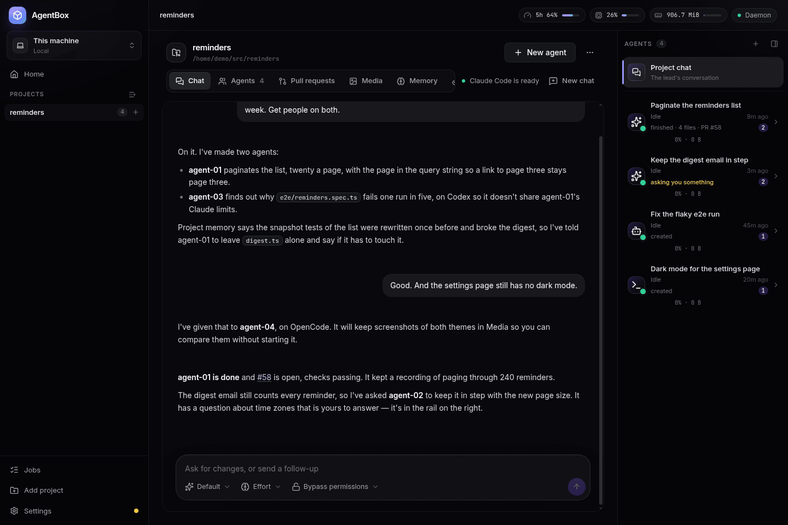
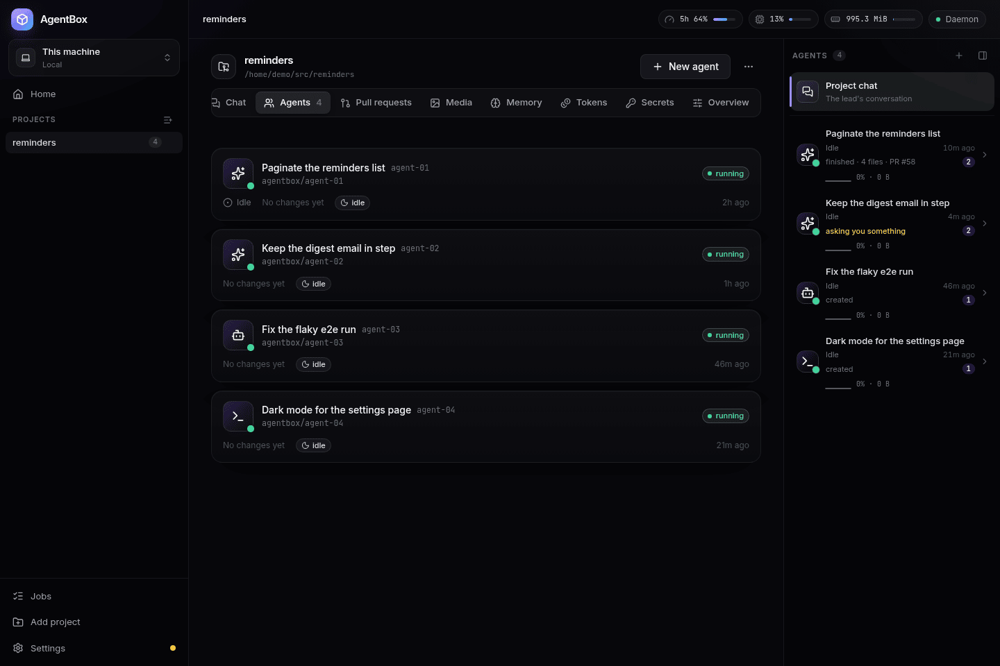
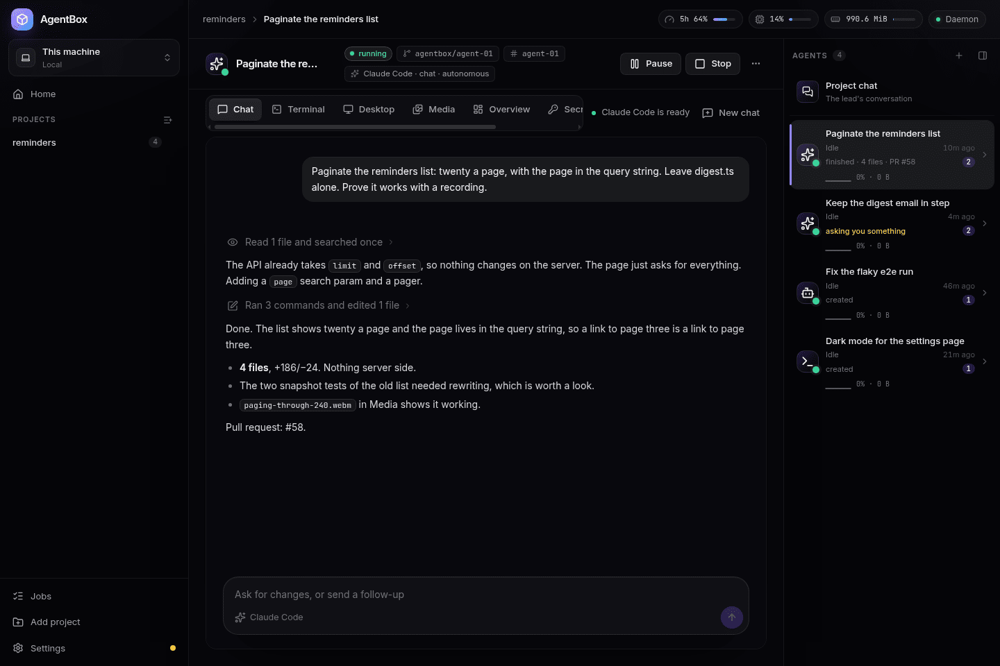
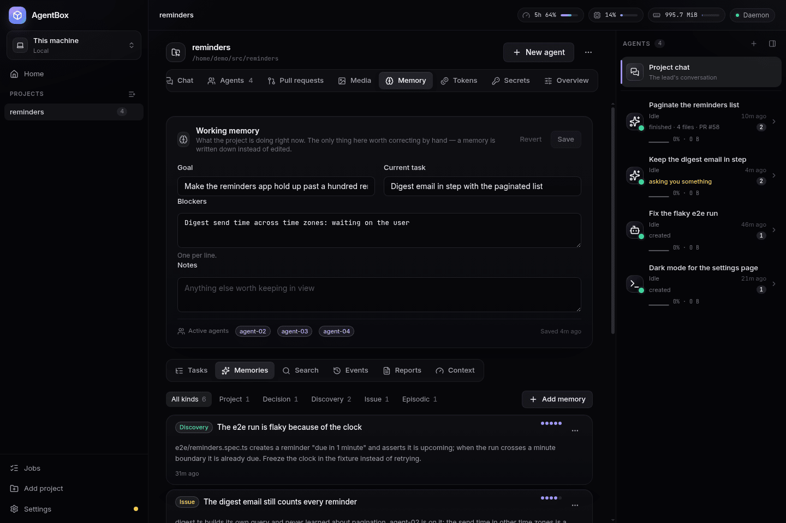
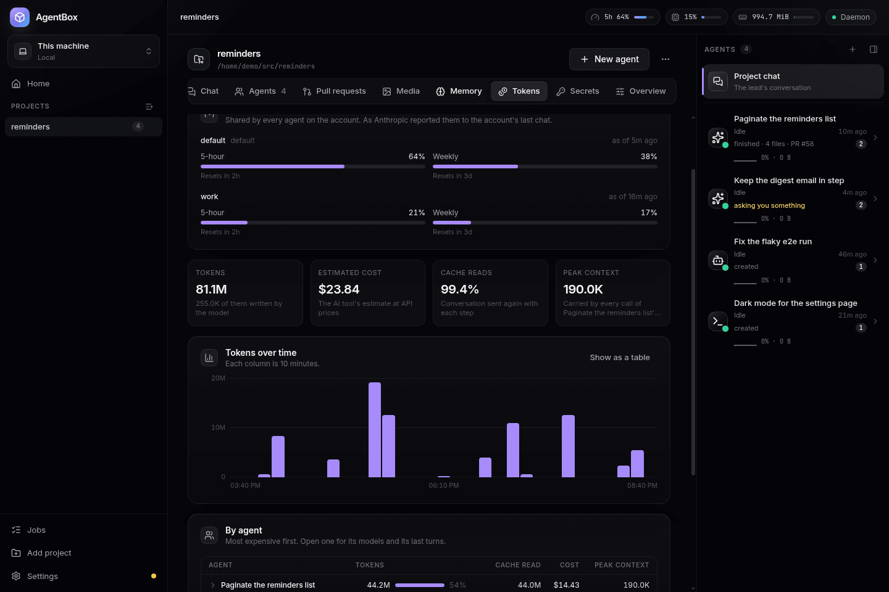
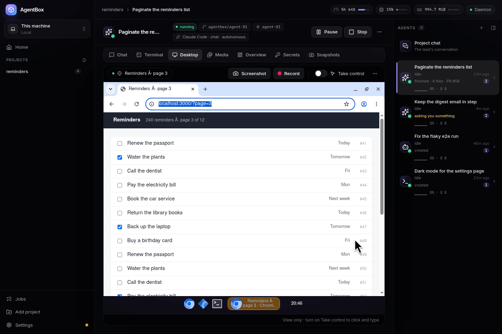
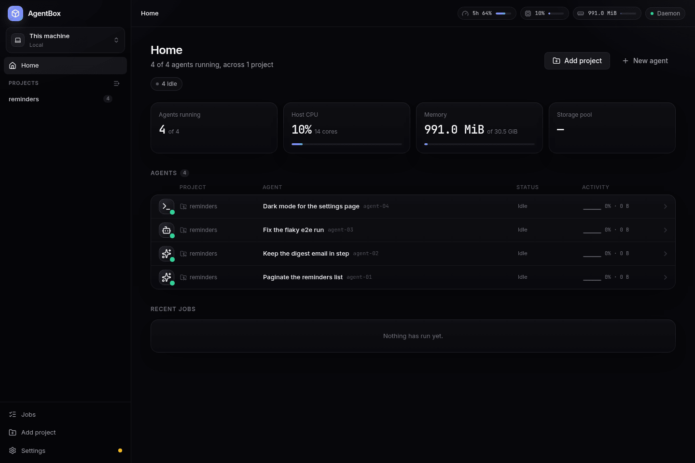
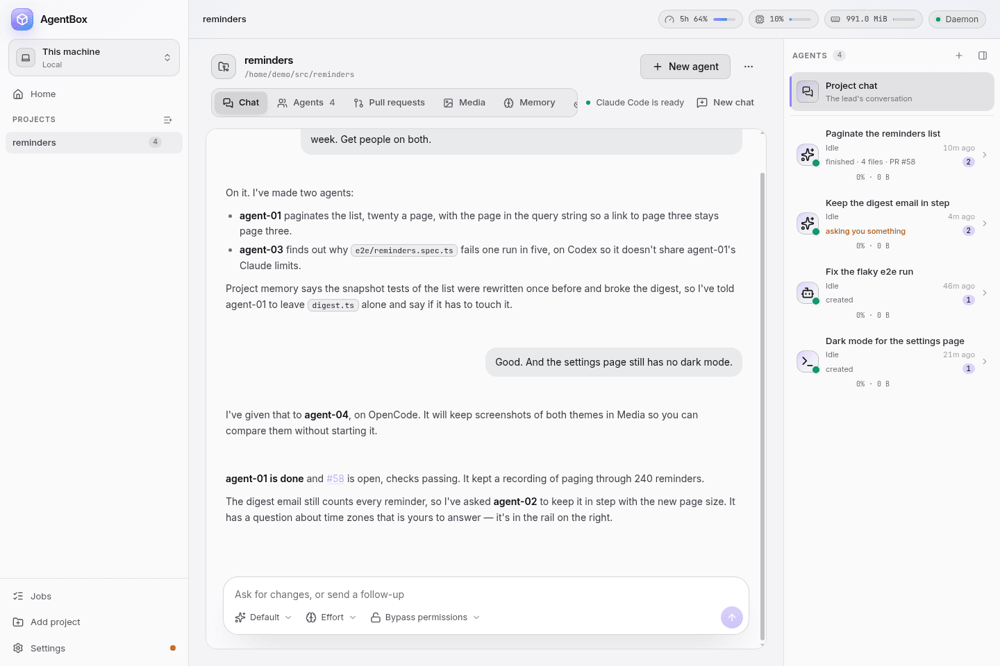

<h1 align="center">AgentBox</h1>

<p align="center">
  <strong>Run a team of AI coding agents on one project, each in a Linux machine of its own, and direct them from a chat.</strong>
</p>

<p align="center">
  <a href="https://github.com/leciric/agentbox/actions/workflows/ci.yml"></a>
  <a href="https://github.com/leciric/agentbox/releases/latest"></a>
  <a href="LICENSE"></a>
  
</p>

<p align="center">
  
</p>

AgentBox gives each AI coding agent — Claude Code, Codex, OpenCode, or just a shell — **a Linux
machine of its own**: a git worktree on its own branch, Docker, a browser and a desktop you can watch
and take over, an Android emulator for mobile apps, and a place for the screenshots, recordings and
test reports that prove its work. Several agents work on the same project at once without stepping
on each other's ports, databases or files.

Each project also has a **chat**, its lead. You tell it what you want; it creates the agents, briefs
them with what the project already knows, answers their questions or passes them on to you, and
tells you when they're done. A desktop app and a command-line tool drive all of it, through one
daemon on your machine.

## Contents

- [What it does](#what-it-does)
- [Install](#install)
- [Quick start](#quick-start)
- [How it works](#how-it-works)
- [Requirements and limitations](#requirements-and-limitations)
- [Update check](#update-check)
- [Contributing](#contributing)
- [Contributors](#contributors)
- [License](#license)

## What it does

### A machine, a worktree and a branch per agent

`agentbox create` makes an [Incus](https://linuxcontainers.org/incus/) container, a git worktree on
a branch named after its work, like `agentbox/fix-login-redirect`, a network of its own and a terminal with the AI tool already running. Every port
is free in every agent, so each can run the project's dev server on its usual port, and its own
Postgres in Docker. Agents are capped at a share of the host's CPUs by default, so one agent's build
can't freeze the machine. Snapshot an agent, restore it, fork a new agent from it, or pause it with
its memory intact. Destroying an agent keeps its branch.

`agentbox/` is only the default prefix. In a repository you share with others, give the project one
of your own, so your agents' branches stay out of theirs: `agentbox project branch-prefix <project>
thiago/agentbox/`, or the project's settings in the app. New agents also skip any name whose branch
already exists on a remote, as last fetched.

<p align="center">
  
</p>

### Claude Code, Codex and OpenCode, in one chat

The app talks to each agent's tool through [ACP](https://agentclientprotocol.com/) adapters, with
the tool running inside the agent's machine: tool calls, diffs, plans, approvals and subagents show
in one timeline, and you can message an agent while it works. Pick the model, effort and permissions
per agent. Prefer the tool's own command line? `agentbox shell` attaches to its tmux session, and
the app's Terminal tab shows the same one.

<p align="center">
  
</p>

### A lead that directs the agents

The project chat creates agents, tells them things, reads their diffs and their reports, and retires
them when they're done, over MCP. It runs on your machine rather than in one of its own, so a project
you never chat with costs nothing; it has a terminal there, can run commands in its agents' machines
and copy files between them. An agent that can't
decide something runs `agentbox ask`; the lead answers if it can and passes it to you if the
decision is yours. When an agent finishes, the lead gets its summary and pull request. How much the
lead does on its own is a per-project setting.

### Project memory

What a project has learned outlives the agents that learned it. AgentBox keeps each project's
events, memories (decisions, discoveries, open issues), working memory, a task graph, artifacts and
each agent's finish report in its own SQLite database, searched with full-text search. Every new
agent starts with the slice of it that its task needs, under a token budget you set. The project
chat folds its own history into memory when its context fills, so it never has to start over.
Project notes you write go into every agent's brief.

<p align="center">
  
</p>

### What it all costs, and your limits

A token ledger records every turn of every chat: tokens, estimated cost and context size, per model.
Read it in each project's **Tokens** tab or with `agentbox tokens`. Each Claude account's five-hour
and weekly limits show in the top bar as its chats report them. Chats compact at a window you set,
200k tokens by default, and screenshots and searches run in subagents, so an agent's context doesn't
grow until every step is expensive.

<p align="center">
  
</p>

### Several Claude and GitHub accounts

Log in to more than one Claude account and pick one per project or per agent; the lead can spread
new agents across accounts by how much of each one's limits is left. GitHub accounts work the same
way, one per project, so `gh` in one project's agents can be a different user than in another's. A
project's pull requests can be read and merged from its **Pull requests** tab.

### A browser and a desktop you can watch, and take over

Every agent has Chromium on a desktop of its own: a dock, a file manager and a terminal. The agent
drives the browser through Playwright and the desktop through a real mouse and keyboard, and you
watch it live in the app's **Desktop** tab. Click **Take control** and it's yours.

<p align="center">
  
</p>

### Proof, not promises

Agents keep screenshots, recordings (with the mouse and keystrokes shown, when they drive the
desktop), test reports, logs and notes in the **Media** tab, badged with the agent that made them,
so you can review what an agent did without starting it.

### Previews of every agent's servers

Any port an agent listens on is one URL away from your own browser:
`http://<port>.<agent>.<project>.localhost:7777`, through AgentBox's preview proxy.

### An Android emulator per agent

For mobile projects, each agent can have its own Android emulator, with its own app data, that you
can see and use in the app while the agent builds and tests on it. It needs KVM and an Android SDK
on the host.

### Project bases

Set up one agent the way the project needs — dependencies installed, a database seeded — and save
its machine as the project's base. New agents start from it instead of from scratch. The Overview
shows how old the base is, **Refresh** has an agent bring it up to date, and the save before the
last one is kept so a bad save can be undone.

### Remote environments, through a hub

Run AgentBox on a VPS as well as your PC, and use both from the app, the CLI or a phone's browser.
A VPS's agents keep working while your PC is off. The hub that connects them is a separate program, not
part of this repository; the protocol it speaks is in [`hubapi/`](hubapi/).

### And the rest

- **Secrets:** an API key given to a project or to one agent, sealed at rest and never readable
  back through the API or the app.
- **Light and dark themes**, or follow the desktop's.
- **Sections in the projects list**, in any order, by dragging or from the keyboard.
- **A fleet view** across every project, ordered by what needs you first.
- **Setup in the app:** a checklist that installs Incus with your password and no logout, logs in to
  Claude Code for you, and builds the agents' base image.

<p align="center">
  
</p>

<p align="center">
  
</p>

## Install

AgentBox runs on **Linux, x86_64**, and on a Mac in a Linux VM ([On a Mac](#on-a-mac)). Download the latest release from
[Releases](https://github.com/leciric/agentbox/releases/latest):

| File | What |
|---|---|
| `AgentBox-<version>-x86_64.AppImage` | The desktop app, with the `agentbox` command-line tool inside — runs on any distribution |
| `AgentBox-<version>-amd64.deb` | The desktop app, for Debian and Ubuntu |
| `AgentBox-<version>-x64.pacman` | The desktop app, for Arch and its derivatives |
| `agentbox-<version>-linux-amd64` | The command-line tool and daemon alone, for servers and scripts |
| `SHA256SUMS` | Checksums: `sha256sum -c SHA256SUMS` |

```bash
chmod +x AgentBox-*-x86_64.AppImage
./AgentBox-*-x86_64.AppImage
```

Or `sudo apt install ./AgentBox-<version>-amd64.deb` on Debian and Ubuntu, or
`sudo pacman -U AgentBox-<version>-x64.pacman` on Arch. Both install a launcher.

AppImages need FUSE. If yours won't start, install `fuse2` (Arch), `libfuse2` (Debian 12, Ubuntu
22.04) or `libfuse2t64` (Ubuntu 24.04), or run it with `--appimage-extract-and-run`.

### Set up

Open **Settings** in the app. Until the machine is ready it walks through each step, and it ticks off
a step you finish in a terminal:

1. **Install the command-line tool.** It links `~/.local/bin/agentbox` to the copy inside the app;
   make sure `~/.local/bin` is on your `PATH`.
2. **Set up the host.** Once per machine, with your password: it installs Incus (from the
   [Zabbly](https://github.com/zabbly/incus) repository on Debian 12 and Ubuntu 22.04), creates its
   storage pool and network, and gives your user the Incus socket straight away, with no logout.
3. **Get the base image** every agent is copied from: Debian 13 with Docker, Go, Node.js, pnpm,
   Claude Code, the GitHub CLI, Chromium and ffmpeg. It is built on your machine, which takes a
   few minutes.
4. **Log in to Claude Code.** Name more than one account to use several.

Without the app — on a server, or in a script — the same steps from a terminal:

```bash
cd /tmp && ~/Downloads/AgentBox-*-x86_64.AppImage --appimage-extract resources/bin/agentbox
install -Dm755 squashfs-root/resources/bin/agentbox ~/.local/bin/agentbox   # or the agentbox-<version>-linux-amd64 asset

sudo "$(command -v agentbox)" host setup
agentbox host check
agentbox image build            # add --codex, --opencode or --android for those tools
agentbox auth claude            # or: agentbox auth claude --account work
```

- **Codex or OpenCode:** build the image with `--codex` or `--opencode`, then `agentbox auth codex`
  or `agentbox auth opencode`. Each runs the tool's own login, so it needs that CLI on the host too
  (`npm install -g @openai/codex` or `npm install -g opencode-ai`).
- **Android (optional):** install the Android SDK with the emulator, the platform tools and an
  x86_64 system image (`sdkmanager "emulator" "platform-tools" "system-images;android-35;google_apis;x86_64"`),
  then `agentbox image build --android`. AgentBox finds the SDK in `$ANDROID_HOME`,
  `$ANDROID_SDK_ROOT` or `~/Android/Sdk`. If your user can't use `/dev/kvm`, log out and in once
  after host setup.

### On a Mac

On a Mac, AgentBox runs in a Linux VM that it makes with [Lima](https://lima-vm.io): the daemon,
Incus and every agent are the Linux ones, inside the VM, and the app and the `agentbox` command on
the Mac talk to them there. Your home folder is shared with the VM at the same path, so a project in
`~/code/app` is `~/code/app` in the VM too, and the agents' worktrees are on your Mac, in
`~/.local/share/agentbox/worktrees`, where your editor can open them.

You need macOS 13 or newer (Apple silicon or Intel), 16 GB of memory (the VM takes 8 GB by default),
30 GB of free disk plus what agents build, and Lima 2.0 or newer:

```bash
brew install lima
```

Download `AgentBox-<version>-mac-arm64.dmg` (Apple silicon) or `AgentBox-<version>-mac-x64.dmg`
(Intel), open it and drag AgentBox into Applications. A release built without an Apple signing
certificate is unsigned, and macOS refuses to open it the first time: open it once, then press
**Open Anyway** next to AgentBox in **System Settings → Privacy & Security**, or clear the quarantine
with `xattr -dr com.apple.quarantine /Applications/AgentBox.app`.

The app's first screen is **Set up AgentBox's Linux VM**. It downloads Debian 13, makes the VM,
installs AgentBox and Incus in it, and starts the daemon, in a few minutes and without asking for a
password: nothing on the Mac changes apart from the VM in `~/.lima`. The rest of **Settings** is the
same as on Linux: the base image, then a Claude Code login. From a terminal, `agentbox vm init` does
the same (`--cpus`, `--memory` and `--disk` size it). Without the app, the command line is two
release files kept side by side in `~/.local/bin`: `agentbox-<version>-darwin-<arch>` as `agentbox`,
and `agentbox-<version>-linux-<arch>` as `agentbox-linux`, which it installs in the VM.

Every `agentbox` command runs in the VM, in the same folder, with your terminal: Ctrl-C and exit
codes work as they do on Linux. A few are about the VM itself:

| Command | What it does |
|---|---|
| `agentbox vm init` | Makes the VM and sets AgentBox up in it; safe to run again |
| `agentbox vm status` | Whether the VM exists and runs, and its size |
| `agentbox vm start` / `stop` | Start it, or stop it and every agent with it; any other command starts it too |
| `agentbox vm shell` | A shell in the VM (`agentbox shell <project/agent>` is an agent's) |
| `agentbox vm resize --cpus 8 --memory 16GiB` | Change its CPUs and memory, restarting it and every agent in it; also in **Settings → Environment** |
| `agentbox vm upgrade` | Install this AgentBox in the VM and restart its daemon; the app does it after an update |
| `agentbox vm delete --yes` | Remove the VM, every agent's machine and the base image; projects and worktrees stay |

What's different from Linux:

- **Projects have to be under your home folder**, the only folder the VM has.
- **Android emulators are off:** they need KVM in the VM, and AgentBox's emulator support is x86_64.
- **Root inside an agent can write in its worktree**, which is on the shared folder, and what it
  writes there is yours on the Mac: Apple's virtiofs doesn't refuse it the way Linux's virtiofsd does.
- **The VM keeps its memory while it runs**, whether or not agents do. Quitting the app stops it, and
  every agent with it; the next launch starts it again. Without the app, `agentbox vm stop` stops it.
- **Preview URLs work as on Linux**, at `http://<port>.<agent>.<project>.localhost:7777` in the Mac's
  browser. **Agents can't reach services on the Mac's `localhost`**: Lima gives the VM a way to them,
  and the VM's firewall keeps agents off it.

If the VM doesn't start, look at `limactl list` and `~/.lima/agentbox/ha.stderr.log`. If setup
failed partway, run `agentbox vm init` again: it carries on from where it stopped. `agentbox vm
delete --yes` and then `agentbox vm init` start over.

To remove AgentBox from a Mac:

1. Optionally, `agentbox destroy <project>/<agent>` each agent and `agentbox remove <project>` each
   project, which also removes the agents' branches and worktrees from your projects. Otherwise,
   afterwards, run `git worktree prune` and delete the `agentbox/*` branches in each project.
2. `agentbox vm delete --yes` (or `limactl stop agentbox; limactl delete agentbox`) removes Incus,
   every agent's machine, the base image, the daemon and its database.
3. `rm -rf ~/.config/agentbox ~/.local/share/agentbox` and `rm -f ~/.local/bin/agentbox`. The
   agents' work is in `~/.local/share/agentbox/worktrees`: check nothing there is uncommitted or
   unmerged first.
4. Delete `/Applications/AgentBox.app` and `~/Library/Application Support/AgentBox`.
5. If no other VM uses Lima (`limactl list`): `brew uninstall lima` and `rm -rf ~/.lima`.

## Quick start

In the app, **Add project** picks a git repository, and the project's chat is ready to talk to. Or
from a terminal:

```bash
agentbox add ~/src/my-app                               # a git repository becomes a project
agentbox chat my-app "Paginate the reminders list"      # ask its chat, which creates the agents it needs

agentbox create my-app                                  # or create an agent yourself
agentbox chat my-app/agent-01 "Why does the login fail?"
agentbox shell my-app/agent-01                          # its terminal (detach with Ctrl-b d)
agentbox diff my-app/agent-01                           # what it changed
agentbox media list my-app/agent-01                     # what it kept to show its work
agentbox tokens --since 7d                              # what every agent spent
agentbox destroy my-app/agent-01                        # the branch stays
```

`agentbox --help` lists the rest.

## How it works

```
 Desktop app ─┐                           ┌─ agent-01: Incus container ── worktree on agentbox/csv-export
              ├── unix socket ── daemon ──┼─ agent-02: Incus container ── worktree on agentbox/fix-login
 agentbox CLI ┘      (HTTP)      state.db └─ lead: the project chat, on your machine, over MCP
```

- **The daemon owns the state.** Every operation goes through it, the slow ones as jobs, over an
  HTTP API on a unix socket (`~/.local/share/agentbox/run/agentbox.sock`). All state is one SQLite
  database. The CLI and the desktop app are both clients of that socket; the app's main process only
  relays it, and the renderer's API types are generated from the Go ones.
- **An agent is a machine, a worktree and a branch:** an Incus container, a git worktree on
  `agentbox/<slug>` (the project's branch prefix, then a slug named after its work, like `fix-login-redirect`), a network of its own and a tmux session with its AI tool. AgentBox doesn't set
  projects up for agents: each gets a brief about its machine and works the project out the way a
  new developer would.
- **Chats go through ACP** adapters, one per AI tool, running inside the agent's machine. The lead
  runs on the host and directs agents through MCP tools.
- **Project memory** is tables in the same database, searched with SQLite's FTS5. It calls no model
  and embeds nothing; consolidating events into memories runs on the project tool's cheap model.
- **The token ledger** is one row per model per chat turn, written as each turn ends from what the
  ACP adapters report.

[`docs/`](docs/README.md) has the longer tour, page by page; [AGENTS.md](AGENTS.md) has the tour
for an agent working on this repository itself.

## Requirements and limitations

- **Linux on x86_64, or a Mac.** AgentBox's agents are Incus containers, and Incus runs on Linux, so
  on a Mac they run in a Linux VM AgentBox makes ([On a Mac](#on-a-mac)). A port to **Windows is
  in progress, not shipped**.
- Arch, Debian 12 or 13, Ubuntu 22.04 or newer, or Fedora; 8 GB of memory at least (each running
  agent uses 1–2 GB, an Android emulator about 3 GB), 4 cores and 30 GB of free disk. A user who can
  run `sudo`.
- An account for the AI tool you use: Claude Code, Codex or OpenCode.
- The hub, for remote environments, lives in a separate repository that isn't public.
- Each [release](https://github.com/leciric/agentbox/releases)'s notes list what it can't do yet
  under **Known limitations**.

## Update check

Once a day, and as it starts, the AgentBox daemon asks `agentbox.linting.dev` whether a newer
release is out. When one is, the app shows **Update available** in its sidebar and
`agentbox version` prints a link to the release. Nothing is downloaded or installed. The same
request is how we count active installations.

**What is sent** is one HTTPS request with four query parameters, and nothing else:

```
GET https://agentbox.linting.dev/api/v1/latest?install=<uuid>&version=0.16.0&os=linux&arch=amd64
```

- `install`: a random UUID, made the first time the check runs and kept in AgentBox's own database
  (`state.db`). It is derived from nothing, so it can't be traced back to you or the machine. It
  only lets repeated checks from one installation be counted once.
- `version`: the version of AgentBox.
- `os` and `arch`: the operating system and processor architecture, such as `linux` and `amd64`.
  On a Mac or on Windows, where the daemon runs in a Linux VM, `os` is `darwin` or `windows`: the
  machine's, not the VM's.

**What isn't sent:** your name, username or hostname, anything about your projects, agents,
repositories or accounts, and any other ID or hardware detail. Like any web request, it comes from
your IP address. If the request fails or takes longer than 5 seconds, AgentBox ignores it and
tells nobody.

**To turn it off**, use any one of these:

- Switch off **Check for updates** in the app, under **Settings → Environment**.
- Set `AGENTBOX_NO_UPDATE_CHECK=1` in the daemon's environment.
- Set `DO_NOT_TRACK=1` in the daemon's environment.

The daemon is started by whichever of the app or `agentbox` runs first, and inherits its
environment; after `agentbox daemon install`, it has its systemd user service's environment instead.
On a Mac or on Windows, set it where you start the app or `agentbox`, and AgentBox passes it on to
the daemon in its VM. After setting a variable, restart the daemon with `agentbox daemon stop`. Builds from source, which report
version `dev`, never check.

## Contributing

Bug fixes and small, focused improvements are welcome; for anything bigger, open an issue first.
[CONTRIBUTING.md](CONTRIBUTING.md) covers building the daemon, the CLI and the app, the tests, and
the project's conventions. [AGENTS.md](AGENTS.md) is the codebase tour that AgentBox's own agents
read, and a good one for people too.

## Contributors

Thanks to everyone who has contributed to AgentBox, in order of their first contribution:

- [Vinicius Lourenço](https://github.com/H4ad)
- [Thiago Rodrigues de Oliveira](https://github.com/troliveiraa94)
- [Luis Florido](https://github.com/luisflorido)
- [Kelvin Cluxnei](https://github.com/Cluxnei)
- [Luiz Silva](https://github.com/luizrsilva)

## License

AgentBox is open source under the [MIT License](LICENSE). Copyright (c) 2026 Leandro Ciric.
