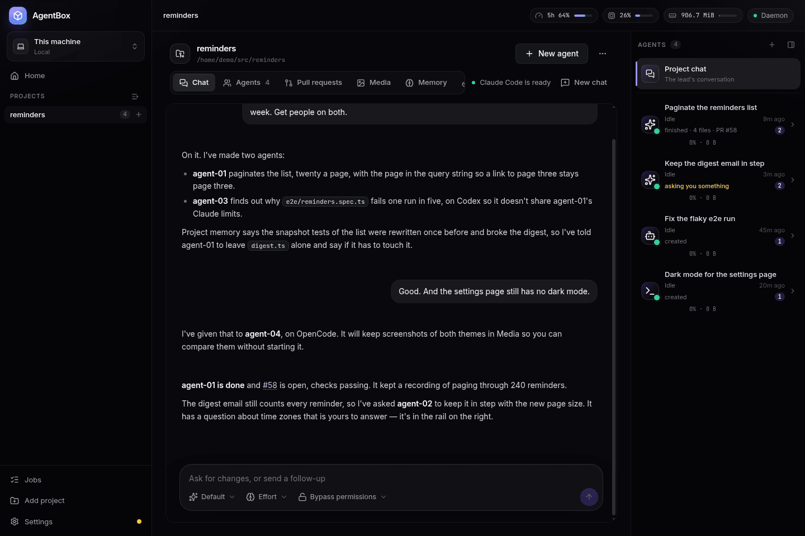

<h1 align="center">AgentBox</h1>

<p align="center">
  <strong>Run a team of AI coding agents on one project, each in a Linux machine of its own, and direct them from a chat.</strong>
</p>

<p align="center">
  <a href="https://github.com/leciric/agentbox/actions/workflows/ci.yml"></a>
  <a href="https://github.com/leciric/agentbox/releases/latest"></a>
  <a href="LICENSE"></a>
  
</p>

<p align="center">
  
</p>

AgentBox gives each AI coding agent — Claude Code, Codex or OpenCode — **a Linux machine of its
own**: a git worktree on its own branch, Docker, a browser and desktop you can watch and take over,
and a place for the screenshots, recordings and test reports that prove its work. Several agents
work on the same project at once without stepping on each other's ports, databases or files. A
**lead**, the project's own chat, creates them, briefs them, answers their questions or passes them
to you, and tells you when they're done.

Everything here is driven from the desktop app: add a project, talk to its lead, watch an agent
work on its own desktop, and review what it built before merging.

## Contents

- [What it does](#what-it-does)
- [Install](#install)
- [Quick start](#quick-start)
- [Requirements and limitations](#requirements-and-limitations)
- [Update check](#update-check)
- [Reporting a problem](#reporting-a-problem)
- [The command line](#the-command-line)
- [Contributing](#contributing)
- [Contributors](#contributors)
- [License](#license)

## What it does

- **A machine per agent:** an [Incus](https://linuxcontainers.org/incus/) container with its own
  worktree, branch, network and desktop, so agents never collide on ports, files or databases.
  Snapshot one, restore it, fork a new agent from it, or pause it with its memory intact.
- **Claude Code, Codex and OpenCode, in one chat**, through [ACP](https://agentclientprotocol.com/)
  adapters: tool calls, diffs, plans and subagents all show in one timeline.
- **A lead that directs the agents** over MCP, on your machine rather than in a container of its
  own, so a project you've never chatted with costs nothing.
- **Project memory** that outlives the agents that made it, so every new agent starts briefed on
  what the project already knows rather than from scratch.
- **A browser and a desktop per agent**, driven by Playwright and a real mouse and keyboard, that
  you watch live and can take over.
- **Proof, not promises:** screenshots, recordings, test reports and logs in the **Media** tab.
- **A token ledger and account limits** in each project's **Settings → Tokens**.
- Preview URLs for any port an agent listens on, several Claude and GitHub accounts, project bases
  new agents start from, an Android emulator per agent, and remote environments through a hub (a
  separate, closed-source program — this repository only carries its side of the protocol, in
  [`hubapi/`](hubapi/)).

[`docs/`](docs/README.md) has the longer tour of how it's built, page by page.

## Install

AgentBox runs on **Linux, x86_64**. Download the latest release from
[Releases](https://github.com/leciric/agentbox/releases/latest):

| File | What |
|---|---|
| `AgentBox-<version>-x86_64.AppImage` | The desktop app, with the `agentbox` command-line tool inside — runs on any distribution |
| `AgentBox-<version>-amd64.deb` | The desktop app, for Debian and Ubuntu |
| `AgentBox-<version>-x64.pacman` | The desktop app, for Arch and its derivatives |
| `SHA256SUMS` | Checksums: `sha256sum -c SHA256SUMS` |

```bash
chmod +x AgentBox-*-x86_64.AppImage
./AgentBox-*-x86_64.AppImage
```

Or `sudo apt install ./AgentBox-<version>-amd64.deb` on Debian and Ubuntu, or
`sudo pacman -U AgentBox-<version>-x64.pacman` on Arch. AppImages need FUSE: install `fuse2` (Arch),
`libfuse2` (Debian 12, Ubuntu 22.04) or `libfuse2t64` (Ubuntu 24.04) if yours won't start.

The app's **Setup** walks you through the rest the first time it runs: making AgentBox's VM,
building the agents' base image, and logging in to Claude Code, Codex or OpenCode.

### AgentBox's VM, on Linux

On Linux, AgentBox runs in a VM of its own: the daemon, Incus and every agent in one
[Cloud Hypervisor](https://www.cloudhypervisor.org) VM, with the CPUs and memory cap you give it
rather than all of your computer's, so heavy agent work can't freeze your desktop. Nothing is
installed on your system and no password is asked. It needs `/dev/kvm` (your user in the `kvm`
group) and an `ssh` client. Setup makes it, at the size you pick; from the command line it's
`agentbox vm init` (`--cpus`, `--memory-cap`), which fetches Cloud Hypervisor, passt, virtiofsd and
Debian's cloud image into `~/.local/share/agentbox/vm` and sets the VM up (about a minute). Every
other `agentbox` command runs in the VM, and until it's made says to run `agentbox vm init`.

The VM starts with 4 GiB and takes more memory as its agents need it, up to its cap (three quarters
of your memory by default), and gives it back as they stop; the top bar's **Free resources** stops
every agent and turns the VM off. Settings → Resources changes its CPUs and cap, as does
`agentbox vm resize`: a running VM changes at once, and its agents keep running. Your home folder is
shared with the VM at the same path, so projects and agents' worktrees stay where they are.
`agentbox vm delete --yes` removes it, and every agent's machine in it. Android emulators run in
the VM's agents when your CPU's KVM module has nested virtualization on (`nested=1`), and boot in
30–50 seconds rather than 20–25; GPUs aren't available in the VM.

### Moving an installation from before the VM

Earlier versions could also run agents directly on your computer's own Incus. An installation set
up that way keeps working exactly as it was until you move it, and nothing of it is deleted. After
updating, the app says once that AgentBox runs in a VM now and takes you to Settings → Setup →
**Move to a VM**; `agentbox vm migrate` does the same from the command line. It moves all of it in
one step: projects, settings, accounts, notes, memory, chats and media, and every agent with its
branch, worktree (uncommitted changes included), title and model. Each agent gets a new
machine in the VM, and its chat carries on; what was installed inside its old machine, and its home
folder outside the worktree, don't come along. It backs `state.db` up first, checks that everything
arrived, and can be run again if it stops half-way. Your system's Incus, and everything else in it,
stays as it was: the agents' old machines stay there, stopped, until you remove them with
`agentbox vm migrate --remove-old` (or the same place in Settings), which removes only AgentBox's
own. Until you remove them, `agentbox vm delete --yes` goes back to running on your system as before.

### macOS and Windows (alpha)

AgentBox also runs on a **Mac**, in a Linux VM it makes for you with [Lima](https://lima-vm.io)
(`brew install lima` first), and on **Windows**, in a WSL2 distro it sets up the same way: the
daemon, Incus and every agent are the Linux ones, and the app and `agentbox` command on your machine
just talk to them there. Both are newer than the Linux build and ship unsigned for now — on a Mac,
right-click AgentBox in Applications and choose **Open** the first time; on Windows, the installer
and antivirus may need an exception. Download `AgentBox-<version>-mac-arm64.dmg` or
`-mac-x64.dmg`, or `AgentBox-<version>-x64-setup.exe` (installer) or `-x64-portable.exe`, from the
same [Releases](https://github.com/leciric/agentbox/releases/latest) page.

On a Mac with Apple Silicon, install [krunkit](https://lima-vm.io/docs/config/vmtype/krunkit/)
before setting AgentBox up, and the VM gives the memory its agents stop using back to your Mac:

```bash
brew tap slp/krun && brew trust slp/krun && brew install krunkit
```

Without it, the VM is made with Apple's Virtualization framework and keeps whatever memory it has
used until it stops. A VM keeps the kind it was made with: to switch an existing one,
`agentbox vm delete --yes` then `agentbox vm init`, which removes every agent's machine (your
projects and worktrees stay).

On a Mac there is also an **experimental** way without Lima: `agentbox vm init --driver vz` (or
**Apple Virtualization, without Lima** in the app's Setup) has AgentBox run the VM itself with
Apple's Virtualization framework, on macOS 13 or later. It hasn't been tried on a real Mac yet; its
VM holds all of its memory while it runs, and `agentbox vm delete --yes` goes back to Lima's. A
build of your own needs signing for it: `scripts/mac-sign.sh bin/agentbox`.

## Quick start

1. **Add project** in the app, and pick a git repository.
2. **Talk to its lead**, the project's chat: tell it what you want, and it creates the agents it
   needs, on their own branches.
3. Open an agent's **Desktop** tab to watch it work — its browser, its terminal, its file
   manager — and click **Take control** any time.
4. Check the **Media** tab for the screenshots, recordings and test reports it kept to show its
   work, and the **Pull requests** tab to read and merge what it built.

## Requirements and limitations

- **Linux on x86_64**, a Mac, or Windows with WSL2 — macOS and Windows are newer and less complete
  than Linux ([macOS and Windows (alpha)](#macos-and-windows-alpha)).
- On Linux: Arch, Debian 12 or 13, Ubuntu 22.04 or newer, or Fedora; 8 GB of memory at least (each
  running agent uses 1–2 GB), 4 cores and 30 GB of free disk; `/dev/kvm`, for AgentBox's VM.
- An account for the AI tool you use: Claude Code, Codex or OpenCode.
- The hub, for remote environments, lives in a separate repository that isn't public.
- Each [release](https://github.com/leciric/agentbox/releases)'s notes list what it can't do yet
  under **Known limitations**.

## Update check

Once a day, and as it starts, the AgentBox daemon asks `agentbox.linting.dev` whether a newer
release is out. When one is, the app shows **Update available** in its sidebar and
`agentbox version` prints a link to the release. Clicking it opens your channel's latest release
as GitHub lists it at that moment (the daemon reads the public list of releases,
`GET https://api.github.com/repos/leciric/agentbox/releases`, with nothing added to it), so a
release made since the last check isn't missed. Nothing is downloaded or installed until you
click it. Clicking it downloads that release's build for your machine from GitHub, checks it,
puts it in place of the one you're running and restarts into it; the command-line tool and the
daemon move to the new version too, the VM's included. The Mac's `.app`, the Windows installer's
install and the portable `.exe` are checked against the release's `SHA256SUMS` (and a Mac app's
code signature), the AppImage against its `latest-linux.yml`. An update waits while jobs are
running. A `.deb` or `.pacman` (only root can replace them), a Mac app still on its disk image or
in a folder you can't write to, and an update that fails open the release page instead.
The same request is how we count active installations.

**What is sent** is one HTTPS request with four query parameters, and nothing else:

```
GET https://agentbox.linting.dev/api/v1/latest?install=<uuid>&version=0.1.0&os=linux&arch=amd64
```

- `install`: a random UUID, made the first time the check runs and kept in AgentBox's own database
  (`state.db`). It is derived from nothing, so it can't be traced back to you or the machine. It
  only lets repeated checks from one installation be counted once.
- `version`: the version of AgentBox.
- `os` and `arch`: the operating system and processor architecture, such as `linux` and `amd64`.
  On a Mac or on Windows, where the daemon runs in a Linux VM or WSL2 distro, `os` is `darwin` or
  `windows`: the machine's, not the VM's.

**What isn't sent:** your name, username or hostname, anything about your projects, agents,
repositories or accounts, and any other ID or hardware detail. Like any web request, it comes from
your IP address. If the request fails or takes longer than 5 seconds, AgentBox ignores it and
tells nobody.

**Anonymous usage stats** go with the check, so we can see which features are used and which
aren't. AgentBox counts uses of a fixed list of features (the `Feature…` keys in
[`internal/api/types.go`](internal/api/types.go), such as `agent.create.claude`, `lead.turn.codex`,
`pr.list` or `menu.agent.destroy`) in `state.db`, per UTC day, and once a day is over it sends the
counts in one more request, with the same four fields as the check:

```
POST https://agentbox.linting.dev/api/v1/usage
{"install":"<uuid>","version":"0.1.0","os":"linux","arch":"amd64",
 "days":[{"day":"2026-09-24","features":{"agent.create.claude":3,"pr.list":1}}]}
```

A key names a feature and nothing about what it was used on: no names, paths, repositories,
models, prompts or anything you typed. Counts the server has are deleted from `state.db`, and
counts it never got are dropped after 31 days. Switch off **Share anonymous usage stats** under
**Settings → General** to stop them and delete what wasn't sent yet; they are also off whenever
the update check is.

**Nightly builds** are built from the next release as it stands, and published as GitHub
prereleases named `<next version>-nightly.<date>.<run>`, such as `0.11.0-nightly.20260929.12`.
They are for trying what's coming, and are never marked as the latest release. To be offered them,
pick **Nightly** under **Update channel** in **Settings → General**, or run
`agentbox version --channel nightly`; a nightly build starts out on that channel, and shows
**Nightly** in the app's sidebar. On the nightly channel the check also asks GitHub for its list of
releases (`GET https://api.github.com/repos/leciric/agentbox/releases`, a public page, with nothing
added to it), since `agentbox.linting.dev` only answers with stable releases. Going back to
**Stable** offers the latest stable release, even though its version is lower than the nightly's.

**To turn the check off**, and the usage stats with it, switch off **Check for updates** in the app under **Settings → General**,
or set `AGENTBOX_NO_UPDATE_CHECK=1` or `DO_NOT_TRACK=1` in the daemon's environment (restart it with
`agentbox daemon stop` afterwards). Builds from source, which report version `dev`, never check.

## Reporting a problem

**Report a problem**, under **Settings → General**, or `agentbox report` sends us what went wrong in
your words, with what helps us find out why: AgentBox's version, your OS and how AgentBox runs on it
(on the machine itself, or in its VM), how its setup stands, the end of the daemon's log and, in VM
mode, of the VM supervisor's, and from the app its own log and recent errors. Tokens, keys, email
addresses and home folders are taken out of all of it, your message included, and you see every part
in full before anything is sent, and can leave any of them out (`agentbox report --show` prints it,
and sends nothing). It goes to `https://agentbox.linting.dev/api/v1/reports` with the same four fields
as the update check, and is kept for 90 days.

**Error reports** are the same, sent by the app itself when it hits an error it didn't expect: the
error, where in the app it happened, and the app's version and OS, with no logs and nothing you
typed. They are off until you turn them on: the first time an error happens, the app asks. Switch
**Send error reports automatically** under **Settings → General** to change your answer. They are
never sent while `DO_NOT_TRACK=1` is set.

## The command line

Everything in the app has an `agentbox` equivalent, for servers and scripts:

```bash
agentbox add ~/src/my-app                               # a git repository becomes a project
agentbox chat my-app "Paginate the reminders list"      # ask its chat, which creates the agents it needs
agentbox diff my-app/agent-01                           # what an agent changed
agentbox media list my-app/agent-01                     # what it kept to show its work
```

`agentbox --help` lists the rest; [`docs/`](docs/README.md) has the architecture behind both.

## Contributing

Bug fixes and small, focused improvements are welcome; for anything bigger, open an issue first.
[CONTRIBUTING.md](CONTRIBUTING.md) covers building the daemon, the CLI and the app, the tests, and
the project's conventions. [AGENTS.md](AGENTS.md) is the codebase tour that AgentBox's own agents
read, and a good one for people too.

## Contributors

Thanks to everyone who has contributed to AgentBox, in order of their first contribution:

- [Vinicius Lourenço](https://github.com/H4ad)
- [Thiago Rodrigues de Oliveira](https://github.com/troliveiraa94)
- [Luis Florido](https://github.com/luisflorido)
- [Kelvin Cluxnei](https://github.com/Cluxnei)
- [Luiz Silva](https://github.com/luizrsilva)

## License

AgentBox is open source under the [MIT License](LICENSE). Copyright (c) 2026 Leandro Ciric.
