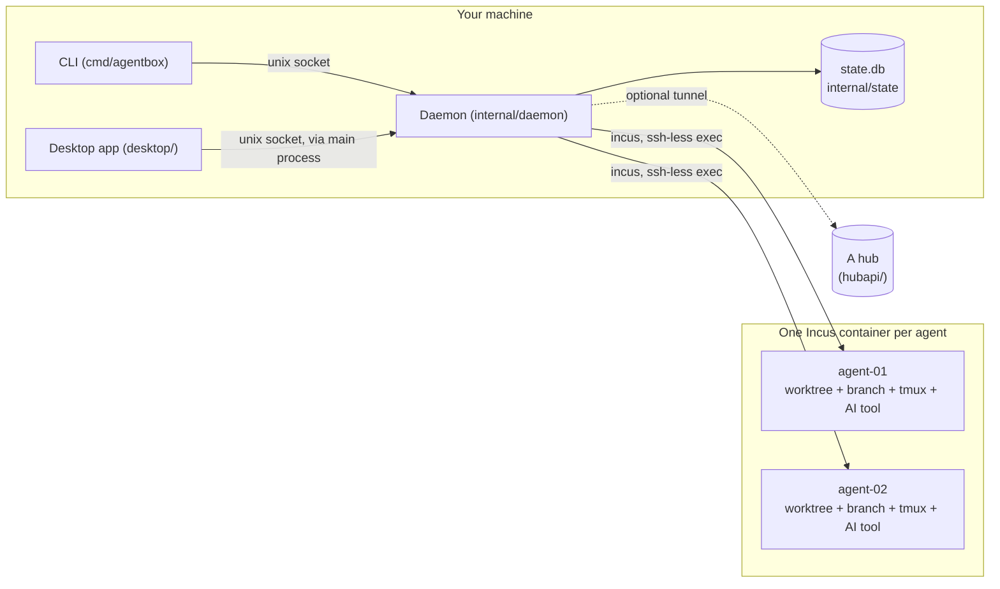

# AgentBox documentation

AgentBox runs several AI coding agents against one project at the same time, each in a Linux
container of its own so they can't collide. It is a Go daemon and command-line tool
(`cmd/agentbox`, `internal/`) plus an Electron desktop app (`desktop/`).

## The shape of it

- **The daemon owns the state.** [`internal/daemon`](../internal/daemon) is the control plane:
  every agent operation goes through it, the slow ones as jobs, and it serves the HTTP API from
  [`internal/api`](../internal/api) over a unix socket at
  `~/.local/share/agentbox/run/agentbox.sock`. All state lives in one SQLite database, `state.db`,
  in [`internal/state`](../internal/state). The CLI is a client of that socket, and so is the
  desktop app.
- **The desktop app is a thin client.** Its main process only relays the socket to the renderer:
  no AgentBox logic, no Incus, no git. The API types the renderer uses are generated from Go into
  [`desktop/src/shared/api.ts`](../desktop/src/shared/api.ts).
- **An agent is a machine, a worktree and a branch.** `agentbox create` gives it an Incus
  container, a git worktree on `agentbox/<name>` (the prefix is a project setting), its own network and a tmux terminal with its AI
  tool already running.
- **A project also has a lead** — its chat — which runs on the host with no machine of its own, so
  a project nobody has chatted with costs nothing. It directs the project's agents over MCP tools
  and never does the work itself.
- **Three AI tools:** Claude Code, Codex and OpenCode, all driven through ACP (Agent Client
  Protocol) adapters.
- **Project memory is what the project knows, kept across agents:** events, memories, tasks,
  artifacts and reports, searched with SQLite FTS5.
- **A hub is optional.** It's a separate, closed-source server; this repository only carries its
  side of the protocol, in [`hubapi/`](../hubapi).

## Pages

- [Architecture](architecture.md) — the daemon, the API over a unix socket, the CLI, the desktop
  thin client, and the `state.db` schema.
- [An agent's lifecycle](agent-lifecycle.md) — `agentbox create` end to end: the Incus container,
  the worktree, the branch, the network, the tmux session, and the states an agent and a job pass
  through.
- [The lead and its MCP tools](lead.md) — what the lead is, how it's chatted with, and every MCP
  tool it can call.
- [Chat over ACP](chat.md) — how AgentBox drives Claude Code, Codex and OpenCode through the
  Agent Client Protocol, and how a turn becomes chat history.
- [Project memory](memory.md) — events, memories, tasks, artifacts, reports, consolidation, and
  the context builder that assembles what an agent is told.
- [The token ledger and Claude accounts](tokens.md) — `token_usage`, `agentbox tokens`, multiple
  Claude accounts, and their five-hour and weekly limits.
- [Project notes and the brief](notes-and-brief.md) — the per-project notes file, and the brief
  each AI tool is given about its machine.
- [The base image](base-image.md) — what's provisioned into the image every agent's container
  starts from, and how it's built on each machine.
- [Building, testing and releasing](building.md) — the Go and desktop builds, CI, and how a
  release is cut.

Every page names the Go packages and files it describes, so you can follow a claim into the code
that backs it.
