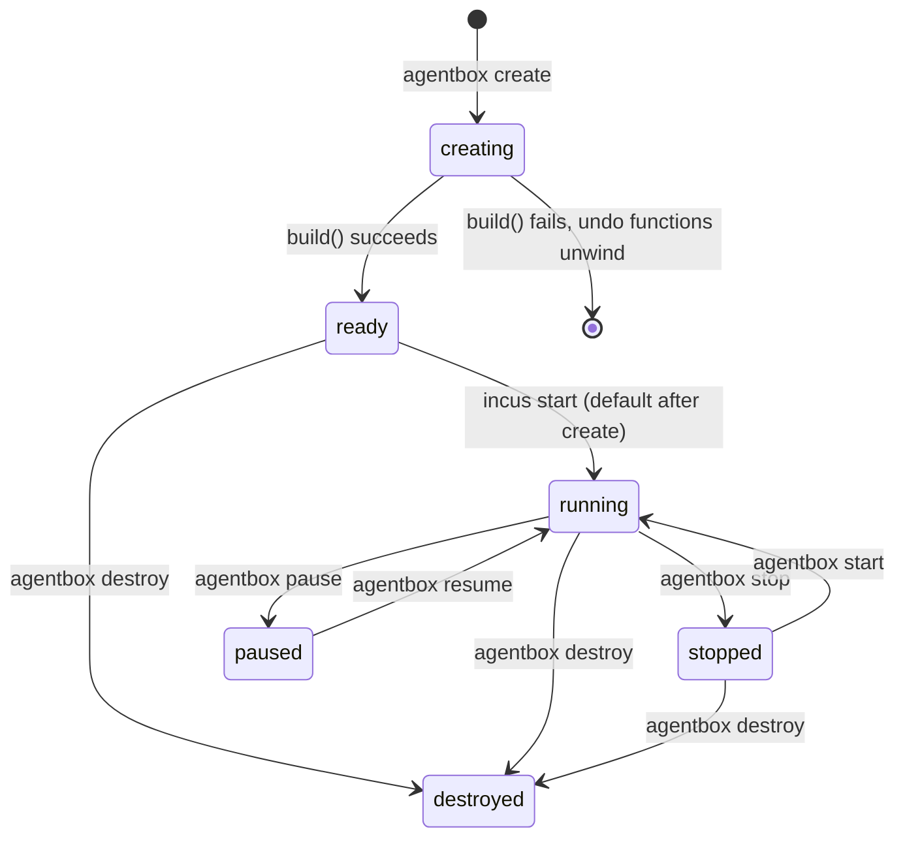
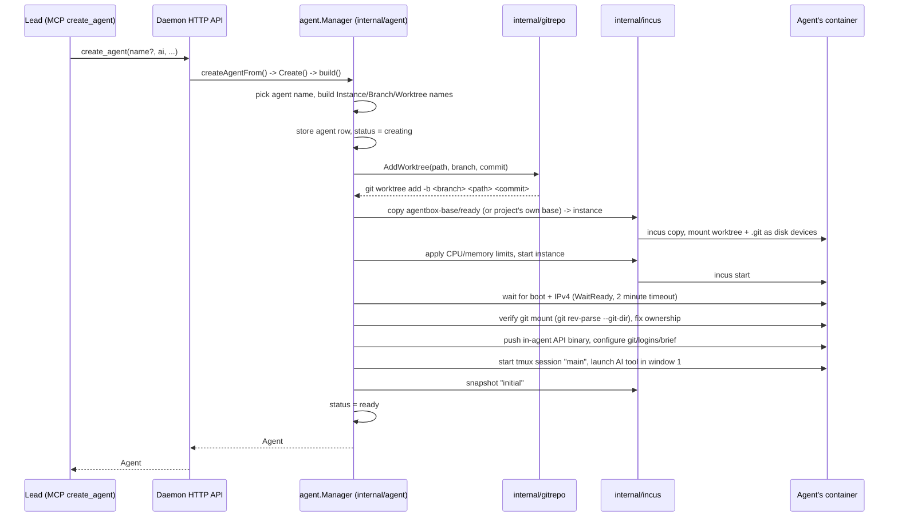
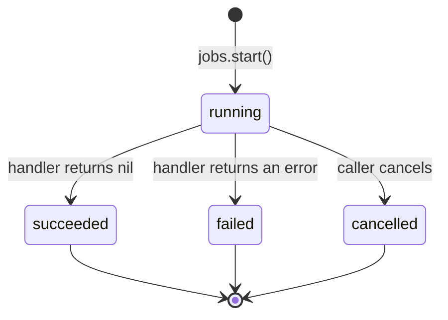

# An agent's lifecycle

[← back to the index](README.md)

An agent is a git worktree, a branch, an Incus container and a tmux session with an AI tool
running in it, all created together by `agentbox create` and torn down together by
`agentbox destroy`.

## What an agent is

The `Agent` row (`internal/state/state.go`) has, among others:

- `Project`, `Name` — identity.
- `Instance` — the Incus container name, `"ab-<project>-<agent>"` (`internal/agent/agent.go`).
- `Branch` — the git branch: the project's branch prefix (`agentbox/` unless it was changed) and the agent's name.
- `Worktree` — the host path, `~/.local/share/agentbox/worktrees/<project>/<agent>`
  (`internal/paths`).
- `Status` — `AgentCreating` or `AgentReady` (`state.go`). This is not the container's power
  state: `agentbox stop`/`pause`/`resume` (`internal/agent/agent.go`, `Manager.Stop`/`Pause`/
  `Resume`) act on the Incus instance directly (`incus stop`/`pause`/`resume`) and don't change
  this column.
- `AI` — which tool it runs: `"claude"`, `"codex"`, `"opencode"`, or `"none"`.
- `Autonomous` — whether its AI tool starts unattended.
- `Role` — `RoleWorker` for a normal agent, or `RoleLead` for the project's chat, which has no
  Incus instance at all (see [The lead and its MCP tools](lead.md)).
- `ClaudeAccount`, `GitHubAccount`, `Interface`, `FinishNotice` — configuration.

`Status` only ever holds the top row of the diagram (`creating`/`ready`); the container states
below it (`running`/`stopped`/`paused`) are read from Incus, not from `state.db`.

## `create_agent`, end to end

Creating an agent is triggered from the lead over its `create_agent` MCP tool (see
[The lead and its MCP tools](lead.md)), or from the CLI/app calling the same daemon endpoint
directly.

Steps, from `build()` in `internal/agent/agent.go`:

1. Pick an agent name if none was given (next free `agent-NN`), and derive `Instance`, `Branch`
   and `Worktree`.
2. Validate the name and check the branch and worktree don't already exist.
3. Store the agent row with `Status = AgentCreating`, registering an undo function.
4. For a Claude Code agent, save its chat defaults.
5. Create the git worktree and branch: `internal/gitrepo`'s `AddWorktree(path, branch, commit)`
   runs `git worktree add --quiet -b <branch> <path> <commit>`; its undo removes the worktree and
   deletes the branch.
6. Optionally copy env files into the worktree.
7. Create the Incus container: copy from a snapshot (the project's own saved base, or
   `agentbox-base/ready` — see [The base image](base-image.md)), strip devices carried over from
   the clone, mount the worktree and its `.git` as disk devices so git crosses the container
   boundary, apply CPU/memory limits, and start it. `WaitReady()` (`internal/incus`) waits up to
   two minutes for systemd and an IPv4 address.
8. Verify the git mount works (`git rev-parse --git-dir` as the agent user) and fix `.git`
   ownership for tools that write next to it.
9. Push the in-agent API binary and set up its proxy device (`internal/agent/agentapi.go`).
10. Configure git, logins and render the brief into the container (`configure()`; see
    [Project notes and the brief](notes-and-brief.md)).
11. Start the tmux session: `ensureSession()` creates a session named `"main"` with a shell
    window, and — for a CLI-interfaced agent — a second window running the AI tool
    (`toolWindowScript()` in `internal/agent/chat.go`), with an `--autonomous` variant when
    `Autonomous` is set.
12. Take an Incus snapshot named `"initial"`.
13. Set `Status = AgentReady` and return the agent.

Any failure before the last step unwinds through the undo functions registered along the way
(dropping the worktree/branch, the database row, and so on), so a failed create doesn't leave a
half-built agent behind.

## Jobs

Anything this slow runs as a job (`internal/daemon/jobs.go`), so the caller isn't blocked and can
follow progress over the event stream or `GET /v1/jobs`:

`create_agent`, `agentbox image build`, and taking or restoring a snapshot are all jobs; their
result is persisted to the `jobs` table (`internal/state`) once they finish, and the job status
matches `internal/api/types.go`'s `JobRunning`/`JobSucceeded`/`JobFailed`/`JobCancelled`.
