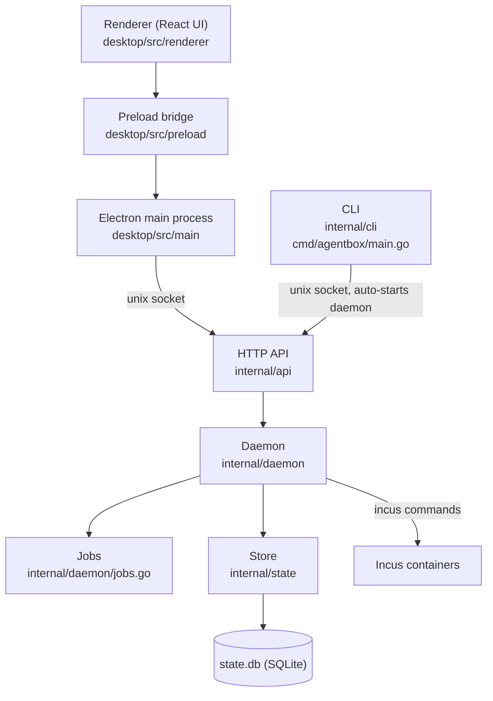
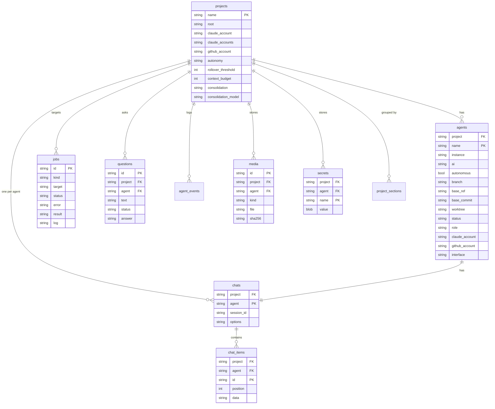

# Architecture

[← back to the index](README.md)

AgentBox is a Go daemon and CLI (`cmd/agentbox`, `internal/`) plus an Electron desktop app
(`desktop/`). The daemon is the only thing that touches Incus, git or the database; the CLI and
the desktop app are both clients of its HTTP API over a unix socket.

## The daemon

[`internal/daemon`](../internal/daemon) is the control plane. `daemon.New(daemon.Config{...})`
builds a `Server` (`server.go`) holding the SQLite store, an event broker, a jobs manager, chat
sessions and the HTTP servers; `srv.Run(ctx)` starts it. It's launched by `internal/cli/daemon.go`,
directly or auto-started by any CLI command that needs it.

The daemon claims a unix socket at `~/.local/share/agentbox/run/agentbox.sock` (checked and
locked in `server.go` so two daemons can't run at once), and serves over 50 routes under `/v1/`
through a plain `http.ServeMux` (`server.routes()`), each handler wrapped to turn a returned error
into a JSON error response.

**Jobs** are how the daemon runs anything slow — creating an agent, building the base image,
running a snapshot — without blocking a request. Defined in
[`internal/daemon/jobs.go`](../internal/daemon/jobs.go): starting a job runs it in a goroutine,
publishes events as it progresses, and persists the result to the `jobs` table. A client polls
`GET /v1/jobs` or follows the event stream. See [An agent's lifecycle](agent-lifecycle.md) for the
job state diagram.

## The API

[`internal/api`](../internal/api) defines the wire types (`types.go`: `Project`, `Agent`, `Job`,
`ChatEvent`, memory types, and more) and a client (`client.go`) that dials the unix socket — or,
for a hub-connected project, an HTTPS base URL with a bearer token (`NewRemoteClient`). Handlers
in the daemon and the client both share these types, so there's one definition of the wire format.

The desktop app's TypeScript types are generated from these Go types, not hand-maintained.
`TestTypeScriptTypesAreUpToDate` in [`internal/api/typescript_test.go`](../internal/api/typescript_test.go)
reflects over the structs and constants listed there and writes
[`desktop/src/shared/api.ts`](../desktop/src/shared/api.ts); the test fails if the checked-in file
is stale, and `UPDATE_TS=1 go test ./internal/api` regenerates it after you change
`internal/api/types.go`.

## The CLI

[`internal/cli`](../internal/cli), entered from `cmd/agentbox/main.go` via `NewRootCmd()`
(`root.go`), is a client of the daemon's socket: `app.client()` builds an `api.Client` against it,
auto-starting the daemon (`a.startDaemon()`) if nothing answers, and restarting a stale one
(wrong version, or missing the `incus-admin`/`kvm` group) when no job is running.

Command groups include: project management (`add`, `projects`, `project`, `remove`, `notes`,
`brief`), agents (`create`, `list`, `retire`, `destroy`, `start`, `stop`, `pause`, `resume`),
communication (`shell`, `exec`, `chat`, `ask`, `questions`), auth (`auth`, `claude`, `github`),
utilities (`daemon`, `jobs`, `events`, `media`, `tokens`, `limits`), desktop-related
(`desktop`, `browser`, `android`), the base image (`image`), and hub/remote (`env`, `login`,
`logout`).

## The desktop app is a thin client

- `desktop/src/main` is the Electron main process. It only relays the socket to the renderer —
  it holds no AgentBox logic, doesn't shell out to Incus or git, and doesn't touch the database.
  `connection.ts` builds the request options (socket path, or an HTTPS hub URL with a stored
  token) and manages hub credentials via the OS keyring.
- `desktop/src/preload` is the bridge exposed to the renderer through `contextBridge`:
  `agentbox.request()` for API calls, `agentbox.stream.*` for the WebSocket terminal/log streams,
  plus narrow helpers for the CLI, host setup, hubs and media (`agentbox-media://`).
- `desktop/src/renderer` is the React UI (Tailwind, Radix, xterm.js, noVNC). It never talks to the
  daemon directly — only through `window.agentbox.*` from the preload bridge — and imports its
  API types from the generated `desktop/src/shared/api.ts`.

## `state.db`

One SQLite database, `internal/state/state.go`, holds all of AgentBox's state. Migrations are an
append-only, numbered list tracked with `PRAGMA user_version`; a past entry is never edited. The
tables below are the core ones — project memory's tables (`events`, `memories`, `working_memory`,
`artifacts`, `agent_reports`, `memory_duplicates`, `consolidation_passes`, `tasks`,
`task_dependencies`) are covered in [Project memory](memory.md), and `token_usage` and
`claude_limits` in [The token ledger](tokens.md).

- **projects** — one row per project; `claude_account`/`claude_accounts` and `github_account`
  govern which credentials new agents may use (see [The token ledger](tokens.md)), and
  `consolidation`/`consolidation_model`/`context_budget` tune [project memory](memory.md).
- **agents** — one row per agent (and one per project for its lead, with `role = "lead"` and no
  Incus instance). `status` is only `"creating"` or `"ready"` (`state.go`, `AgentCreating`/
  `AgentReady`); stopped/paused/running is Incus container state, not a column here — see
  [An agent's lifecycle](agent-lifecycle.md).
- **jobs** — a slow daemon operation; `status` is `"running"`, `"succeeded"`, `"failed"` or
  `"cancelled"` (`internal/api/types.go`: `JobRunning`, `JobSucceeded`, `JobFailed`,
  `JobCancelled`).
- **chats** / **chat_items** — one chat session per agent (including the lead), and its ordered
  transcript. See [Chat over ACP](chat.md).
- **questions** — an agent's `agentbox ask` to the lead, and its answer.
- **media**, **secrets**, **project_sections** — screenshots/recordings, per-project/per-agent
  secrets, and the app's project grouping.

## The hub, from this side

A hub is the optional server half of AgentBox; it's a separate, closed-source program
([leciric/agentbox-hub](https://github.com/leciric/agentbox-hub)). This repository only carries
its side of the protocol, in [`hubapi/`](../hubapi):

- `hubapi.go` defines the token prefixes (`abx_s_` for a session, `abx_e_` for an environment),
  the session cookie name, the hub's own endpoints (`/v1/auth/...`, `/v1/environments`,
  `/v1/connect`, `/healthz`), and `EnvironmentAPI(id)` — the prefix under which a hub passes a
  request through to that environment's daemon, exactly as it would arrive over the daemon's own
  socket.
- `tunnel.go` frames the WebSocket tunnel an environment dials to a hub.
- `types.go` is the shared request/response shapes.

Nothing in `internal/` imports anything from the hub itself — only from `hubapi/`.
