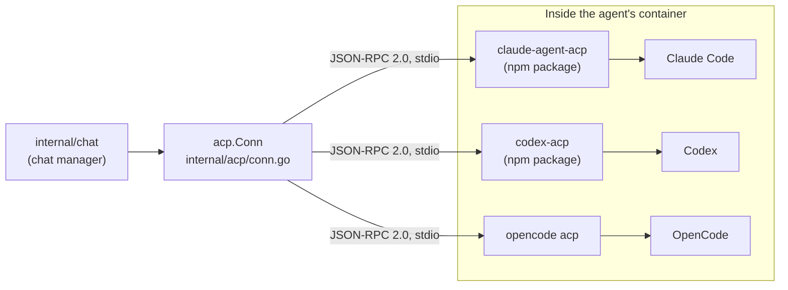

# Chat over ACP

[← back to the index](README.md)

The app's chat drives all three AI tools — Claude Code, Codex and OpenCode — through the same
protocol: [ACP](https://agentclientprotocol.com), the Agent Client Protocol, JSON-RPC 2.0 over an
agent's stdin and stdout, one message per line. The client side lives in
[`internal/acp`](../internal/acp); the chat manager built on top of it is
[`internal/chat`](../internal/chat).



## ACP client

`internal/acp/conn.go` defines `Conn`, which manages one bidirectional connection to an agent
process: `Call()` sends a request and waits for its response, and a `Handler` interface
(`Notify()`/`Request()`) receives what the agent sends back unprompted — streamed message chunks,
tool-call updates, permission requests, usage updates. `internal/acp/types.go` defines the
protocol's own types: `InitializeRequest`/`Response`, `NewSessionRequest`, `SessionResponse`,
`ConfigOption` (the settings — model, effort, permissions — a client can show the user),
`McpServer` (the MCP servers a session should run, stdio-based) and the usage types `Cost` and
`RateLimit` that feed [the token ledger](tokens.md).

## One adapter per tool

`ChatAdapters`, in [`internal/agent/chat.go`](../internal/agent/chat.go), maps each AI tool to the
binary that speaks ACP for it:

```go
var ChatAdapters = map[string]ChatAdapter{
    "claude":   {Tool: "Claude Code", Command: "claude-agent-acp", Package: image.Pin("npm:@agentclientprotocol/claude-agent-acp")},
    "codex":    {Tool: "Codex", Command: "codex-acp", Package: image.Pin("npm:@agentclientprotocol/codex-acp")},
    "opencode": {Tool: "OpenCode", Command: "opencode", Args: []string{"acp"}, Package: image.Pin("npm:opencode-ai")},
}
```

The versions are the ones the base image pins, in
[`internal/image/tools.txt`](../internal/image/tools.txt).

Claude Code and Codex don't speak ACP themselves, so AgentBox runs a separate adapter package in
front of each (`claude-agent-acp`, `codex-acp`) that wraps the tool's own protocol in ACP. OpenCode
speaks ACP natively through its own `acp` subcommand, so there's no wrapper — the adapter is just
`opencode acp`. All three are installed with `mise install` and launched with `mise exec` inside
the agent's container.

## The chat manager

[`internal/chat/chat.go`](../internal/chat/chat.go) holds one `conversation` per agent (including
the lead), each guarded by its own mutex. A `ChatSession` (`internal/api`) carries the session's
state, which AI tool it is, its `ConfigOption`s, and available slash commands; a `ChatItem`
represents one piece of the transcript — a message, a tool call, a thought, or a subagent card —
each tagged with a kind, its turn, and (for something nested under a subagent) a parent id.
Streamed text is batched before it reaches listeners (a `flushDelay`, around 50ms) rather than
flushed on every token.

A subagent spawned mid-turn (Claude Code's Task tool, for example) is announced by the adapter
with a `subagent_spawned` ACP notification and represented as its own `ChatItem` of kind
`"subagent"`; whatever it says nests underneath by `Parent`, so the transcript reads as a tree
rather than a flat log (`internal/chat/subagents.go`).

## The token ledger

[`internal/chat/tokens.go`](../internal/chat/tokens.go)'s `book()` runs once a turn ends: it reads
the turn's per-model token counts from the adapter's `acp.PromptResponse.ByModel`, takes the
turn's cost from a running total the adapter's `usage_update` notifications have been adding to
since the last booking (reset on `/clear`), and writes one row per model via `tokenRows()`
straight to `state.AddTokenRows` — off the chat's own lock, in a background goroutine, so booking
never blocks the conversation. See [The token ledger and Claude accounts](tokens.md) for the
table shape and how it's read back.

## Compaction

A Claude Code chat compacts once its session nears the installation's compact window — 200,000
tokens by default (`ClaudeShortWindow`, `internal/state/contextwindow.go`), because every model
call resends the whole conversation. A project's `rollover_threshold` (`state.go`, default 80%)
sets how full a session gets, measured against `context_tokens` on the ledger, before AgentBox
rolls it over into a fresh session rather than letting the tool's own compaction kick in.
