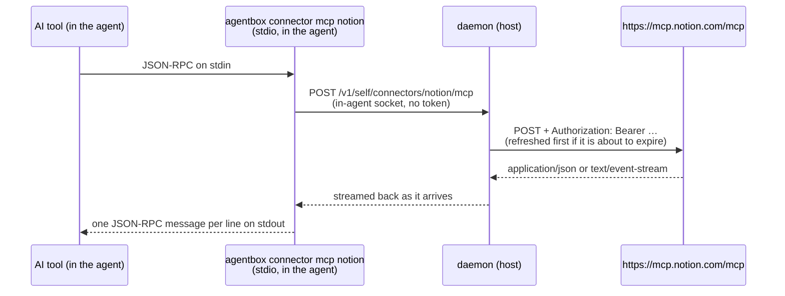

# Connectors: remote MCP servers for agents

[← back to the index](README.md)

A **connector** is a remote MCP server — Notion, Linear, Figma, anything that speaks MCP's
streamable HTTP transport — that a project's agents get as tools. The user signs in once, on the
host; the daemon keeps the tokens and attaches them to every request it relays to the server.
**No token is ever written into an agent's machine**, and no API response carries one.



## Where the code is

- [`internal/state/connectors.go`](../internal/state/connectors.go): the `connectors` table. One
  row per connector, at project scope (`agent = ''`) or for one agent, like secrets. Access token,
  refresh token and client secret are sealed with [`internal/secrets`](../internal/secrets)'s key
  before they reach SQLite.
- [`internal/connectors`](../internal/connectors): the OAuth client (`oauth.go`), the sign-in flow
  and its loopback listener (`flow.go`), the store with refresh (`connectors.go`), the daemon's
  side of the proxy (`proxy.go`), and the agent's stdio side (`relay.go`).
- [`internal/daemon/connectors.go`](../internal/daemon/connectors.go): the routes below.
- [`internal/agent/connectors.go`](../internal/agent/connectors.go): enabled connectors join
  `agentMCPServers`, so Claude Code, Codex and OpenCode all get them, and running agents have
  their MCP configuration rewritten when the set changes.
- `agentbox connector …` ([`internal/cli/connectors.go`](../internal/cli/connectors.go)), and
  `tools` and `call` inside an agent ([`internal/connectors/call.go`](../internal/connectors/call.go)).
- `request_connector`, an agent asking the user for one
  ([`internal/daemon/connectorrequests.go`](../internal/daemon/connectorrequests.go)), and the
  lead's `list_connectors` and `create_agent`'s `connectors` ([`internal/cli/mcp.go`](../internal/cli/mcp.go)).
- The app's Connectors tab, on a project and on an agent
  ([`desktop/src/renderer/components/ConnectorsTab.tsx`](../desktop/src/renderer/components/ConnectorsTab.tsx)):
  a catalog of Notion, Linear, Sentry and Figma plus a custom URL, and each connector with its
  status, its token's expiry, Connect and Disconnect. Connect opens the sign-in in the user's own
  browser and the row updates from `EventConnector`. Figma's preset asks for a personal access
  token straight away, stored as the secret `FIGMA_TOKEN` and sent as `X-Figma-Token`. The presets
  are in [`desktop/src/renderer/lib/connectors.ts`](../desktop/src/renderer/lib/connectors.ts),
  along with the app's `request_connector` card: a question of kind `connector` naming the
  connector (`Question.connector`, or `secretName`) and its `url` when it isn't a preset, answered
  on the credential route with `{"connector": "<name>"}` or a refusal
  ([`ConnectorRequestCard.tsx`](../desktop/src/renderer/components/ConnectorRequestCard.tsx)).

## Scope

A connector belongs to a project (every agent of it gets it) or to one agent. An agent's own
connector of the same name as its project's replaces the project's for that agent, the way an
agent's own secret does. An agent connector goes with its agent; project connectors go with their
project.

An agent can be limited to some of its project's connectors when it is made: `create_agent`'s
`connectors: ["notion"]` (`CreateAgentRequest.connectors`), `[]` for none, left out for every one.
The limit is the agent's `connectors` column, `NULL` for no limit; it names project connectors only,
and one the project doesn't have is refused. A fork is given what its source was. Answering a
`request_connector` for a connector the limit left out adds it to the limit.

A project's chat (the lead) runs on the host with no machine, and is given its project's enabled
connectors all the same, through the same relay: its `~/.claude.json` starts
`agentbox connector mcp <name>` with `AGENTBOX_IN_AGENT_SOCKET` pointed at the lead's socket, which
relays the project's connectors (never an agent's own) on `/v1/self/connectors/{name}/mcp`. Its
MCP servers are rewritten when the project's connectors change, the way a running agent's are.

## How a connector signs in (`auth`)

- **`oauth`** (the default) follows the
  [MCP authorization spec](https://modelcontextprotocol.io/specification/2025-06-18/basic/authorization):
  1. An unauthenticated `initialize` to the server. Its `401`'s `WWW-Authenticate` names the
     protected resource metadata (RFC 9728); without one the client tries
     `/.well-known/oauth-protected-resource/<path>` and then `/.well-known/oauth-protected-resource`.
     The metadata's `resource` must be the server's URL or a prefix of it.
  2. Its first authorization server's metadata (RFC 8414, then OpenID discovery). A server with no
     protected resource metadata at all falls back to the 2025-03-26 rule: its own origin is the
     authorization server, with `/authorize`, `/token` and `/register` when it has no metadata.
  3. Dynamic client registration (RFC 7591), as a public client (`none`) when the server allows
     it, otherwise with a client secret. The registration is kept and reused while its redirect URI
     can be listened on again.
  4. PKCE with S256, a `state`, and the `resource` parameter (RFC 8707) on both the authorization
     and the token request. The redirect URI is `http://127.0.0.1:<port>/callback`, a listener the
     daemon opens for the sign-in and closes once it's over or after 10 minutes.
  5. Tokens are refreshed when a request finds them within two minutes of expiring, and a sweep
     every five minutes refreshes any that will expire within ten, so a token is almost never
     refreshed in the middle of a tool call. A server that rotates refresh tokens gets the new one
     kept. A request answered `401` is refreshed and retried once; if the refresh fails the
     connector turns `error`, "connect it again".
- **`secret`** sends one of the project's secrets (`agentbox secrets`) as a static header: for a
  server with no OAuth, or one that refuses to register AgentBox. `header` defaults to
  `Authorization` and `scheme` to `Bearer` there (nothing for another header). The secret is read
  from the agent's scope first, then the project's, when each request is relayed.
- **`none`**: a public server.

## The API

Every route below is on the daemon's socket, and exists twice: under
`/v1/projects/{project}/connectors` for a project's connectors, and under
`/v1/agents/{project}/{agent}/connectors` for one agent's own. Types are in
[`internal/api/connectors.go`](../internal/api/connectors.go), generated into
`desktop/src/shared/api.ts`. An agent route on a project's lead is refused.

| Method and path | Body | Answer |
| --- | --- | --- |
| `GET …/connectors` | — | `Connector[]`. For an agent: its project's connectors that reach it, then its own. |
| `GET …/connectors/{name}` | — | `Connector`: its status. `404` if there is none. |
| `PUT …/connectors/{name}` | `SetConnectorRequest` | `Connector`. Adds or changes it. Changing `url` or `auth` forgets its sign-in. |
| `DELETE …/connectors/{name}` | — | `204`. Removes it, sign-in and all. |
| `POST …/connectors/{name}/connect` | — | `ConnectResult`: `authorizationUrl` to open in the user's browser. Only for `oauth`. |
| `POST …/connectors/{name}/disconnect` | — | `Connector`, now `disconnected`: its tokens are forgotten, the connector stays. |

`Connector.status` is one of `connected`, `disconnected`, `connecting` (a sign-in is waiting on
the browser) or `error` (with `error` saying why). A sign-in finishing — or failing — publishes an
`EventConnector` (`"connector"`) on `GET /v1/events` with the `Connector`, which is what a client
waits for after `connect` rather than polling; adds, changes and removals publish it too, removals
with `removed: true`.

Errors are the API's usual `{"error": "…"}`. Connect answers `400` with the reason when discovery or
registration fails — Figma's, for one, says the server refused to register AgentBox and to use a
`secret` connector instead.

### Inside an agent

On the agent's own socket (`/run/agentbox.sock` inside it):

| Method and path | Answer |
| --- | --- |
| `GET /v1/self/connectors` | `SelfConnector[]`: the enabled connectors this agent has. |
| `POST`, `GET`, `DELETE /v1/self/connectors/{name}/mcp` | The server's streamable HTTP endpoint, relayed. |
| `POST /v1/self/connector` | `request_connector`, below: waits, then answers with the `Question`. |

The lead's socket has the first two, for its project's connectors, and `GET /v1/project/connectors`
(`Connector[]`, what `list_connectors` describes).

The relay passes `Content-Type`, `Accept`, `Mcp-Session-Id`, `Mcp-Protocol-Version` and
`Last-Event-ID` through, and back `Content-Type`, `Mcp-Session-Id` and `Cache-Control`; nothing else crosses in
either direction, cookies included. A connector that isn't connected answers `409` with the reason,
which the stdio relay turns into a JSON-RPC error for the request.

## `request_connector`

An agent that needs a service it has no tools for asks the user with the `memory` MCP server's
`request_connector`, the way it asks for a credential with `request_credential`. The call waits —
up to two hours, like any question — until the agent can use the connector, or the user declines.

The agent sends (`ConnectorRequest`, `POST /v1/self/connector`):

```json
{"name": "notion", "url": "https://mcp.notion.com/mcp", "reason": "the onboarding spec is in Notion"}
```

`url` is needed only when the project has no connector of that name. A connector the agent can
already use answers at once, and nothing is recorded. Otherwise the request is a `Question` of kind
`connector`, waiting on the user (`escalated`), published as `EventQuestion` like any other:

```json
{
  "id": "4b1f…", "project": "pawly", "agent": "agent-03", "ref": "pawly/agent-03",
  "kind": "connector", "connector": "notion", "url": "https://mcp.notion.com/mcp",
  "question": "the onboarding spec is in Notion", "status": "escalated", "createdAt": "…"
}
```

`url` is the project's connector's when it has one, else the one the agent gave. The app answers it
on the credential route, `POST /v1/projects/{project}/questions/{id}/credential`
(`AnswerCredentialRequest`), with exactly one of:

```json
{"connector": "notion"}
{"refuse": true, "reason": "not this sprint"}
```

The card adds the connector and signs in with the routes above first. `{"connector": …}` turns it on
if it is off and gives it to the agent past its `create_agent` limit; a connector that still can't
be used (not signed in, its secret not set) is refused with why, and the request keeps waiting.
**The request is also answered on its own** as soon as the connector the agent asked for becomes
usable — a sign-in finishing, from the card, the Connectors tab or `agentbox connector connect` — so
the card's own `{"connector": …}` right behind it answers `200` with the request as it is. The lead
can't answer one, nor can a written answer.

The agent is told it's connected, and how to use it at once: every AI tool reads its MCP servers when
its session starts, so a connector connected while it works reaches its native tools
(`mcp__notion__*`) only with its next session. Until then it has them from its shell, through the
same relay, as one short MCP session each:

```bash
agentbox connector tools notion                                          # each tool and the JSON it takes
agentbox connector call notion notion-search '{"query": "onboarding spec"}'   # its text, or --json
```

## The command line

```bash
agentbox connector add pawly notion --url https://mcp.notion.com/mcp
agentbox connector connect pawly notion          # opens the browser, waits for the sign-in
agentbox connector list pawly
agentbox connector add pawly figma --url https://mcp.figma.com/mcp --secret FIGMA_TOKEN --header X-Figma-Token
agentbox connector disconnect pawly notion
agentbox connector remove pawly/agent-01 linear
```

Inside an agent, `agentbox connector mcp <name>` is the stdio server its AI tools are configured
to start; nobody runs it by hand.

## What the real servers do

Checked on 29 September 2026:

- **Notion** (`https://mcp.notion.com/mcp`) answers `401` with `resource_metadata`, publishes
  protected resource and authorization server metadata at its own origin, supports S256, allows
  public clients (`token_endpoint_auth_methods_supported` includes `none`) and **accepts dynamic
  client registration** from a third-party client, as a public client. AgentBox's own client
  gets as far as Notion's sign-in page (`AGENTBOX_LIVE_CONNECTORS=1 go test ./internal/connectors
  -run Live -v` checks it again); signing in needs a Notion account, so the rest of the flow is
  tested against a fake server shaped like Notion's (`internal/connectors/connectorstest`).
- **Figma** (`https://mcp.figma.com/mcp`) answers `401` with `resource_metadata` pointing at
  `https://api.figma.com`, whose metadata advertises a `registration_endpoint`
  (`/v1/oauth/mcp/register`) — but **that endpoint answers `403 Forbidden` to every registration**,
  even an empty body: Figma only lets clients it has approved register (its docs list them).
  AgentBox can't sign in to Figma with OAuth. The fallback is a `secret` connector with a Figma
  personal access token; whether the remote server takes one (as `Authorization: Bearer` or
  `X-Figma-Token`) wasn't checked without a real token — a bogus one gets the same `401` either way.
  Figma's local desktop MCP server is another route, and isn't a connector.

## What it can't do yet

- A session already running doesn't get a connector connected on its request: the agent reaches
  it with `agentbox connector call` until its next session. Nothing restarts the session for it.
- A server that refuses dynamic registration but would take a client ID registered by hand has no
  way to be given one.
- On a Mac, or on Windows, the daemon runs in a VM: the callback is on the VM's `127.0.0.1`, which
  Lima and WSL forward to the host's; a setup that doesn't forward it can't finish the sign-in.
- The relay opens the `GET` stream a server may send messages on outside a request once the session
  starts, and reopens it when it drops; a server without one (`405`) is simply not listened to.
  Server-to-client requests that arrive on it reach the AI tool, and its answers go back as
  ordinary `POST`s, but that path has only been tested against the fake.
- A session already running keeps the MCP servers it started with: a connector added, removed or
  turned off reaches an agent's AI tool at its next session (Claude Code's `/mcp` reconnects).
