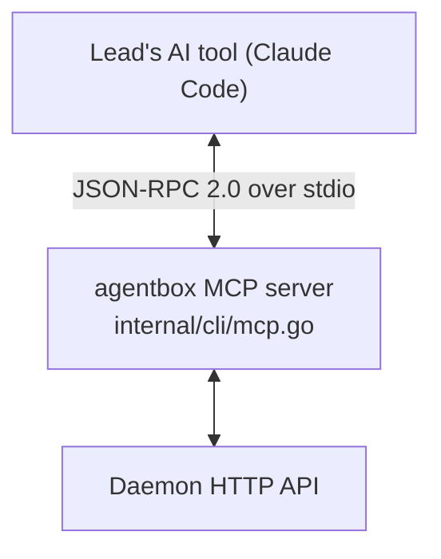

# The lead and its MCP tools

[← back to the index](README.md)

## What the lead is

The lead is a project's own chat: it directs the project's agents but never does the work itself,
and it has no machine of its own — it runs on the host. Concretely, it's still an `Agent` row
(`internal/state`), with `Role = state.RoleLead` and `Name = state.LeadName`
(`internal/daemon/lead.go`), just one with no Incus instance and no worktree.

- `leadFromPath()` (`internal/daemon/lead.go`) returns an ephemeral lead for a read that doesn't
  need to persist one.
- `ensureLeadFromPath()` creates a persistent lead row on first write — so a project nobody has
  ever chatted with costs nothing.
- The lead's chat always runs Claude Code (`ChatTool = "claude"`, `internal/agent/chat.go`).

You reach the lead through the app's chat tab (backed by the daemon's
`/projects/{project}/chat` API), or with `agentbox ask` from the CLI
(`internal/cli/ask.go`) — the same command an agent uses to ask the lead a question mid-task
(see [Chat over ACP](chat.md)).

## Its MCP tools

The lead's AI tool is given an MCP server, `agentbox`, registered from
`internal/cli/mcp.go`. Its tools are how the lead acts on the project — creating and directing
agents, reading and writing project memory, managing notes, and answering the questions agents
escalate to it.

**Agents**
- `create_agent` — create a new agent (name, AI tool, autonomy, Claude/GitHub account, base
  ref/snapshot). See [An agent's lifecycle](agent-lifecycle.md).
- `list_agents` — list the project's agents and their status.
- `tell_agent` — send a message into a running agent's chat.
- `read_agent` — read an agent's chat transcript.
- `agent_diff` — see an agent's uncommitted/branch diff.
- `run_in_agent` — run a shell command inside an agent's container.
- `copy_between_agents` — copy files between two agents' worktrees.
- `retire_agent` — stop an agent and mark it done without destroying it.

**Project memory**
- `search_memory` — full-text search over memories, events and reports (see
  [Project memory](memory.md)).
- `remember` — write a memory (kind, title, content, importance), optionally superseding an
  older one.
- `resolve_memory` — close a memory without replacing it (a bug got fixed, something stopped
  mattering).
- `update_working_memory` — merge a patch into the project's single working-memory row (goal,
  current task, active agents, blockers, notes).
- `project_state` — a read-only snapshot: working memory, open tasks, open issues, recent
  reports.

**Project planning**
- `add_task`, `link_tasks`, `set_task_status` — mutate the project's task graph.

**Project notes**
- `read_notes`, `append_note`, `edit_note`, `remove_note` — read and add to the project's notes
  file, under the lead's own `## From the lead` section (see
  [Project notes and the brief](notes-and-brief.md)).

**Questions and decisions**
- `list_questions`, `answer_question`, `escalate_question` — the other side of `agentbox ask`:
  see what agents have asked, answer them, or pass one to the user.

**Accounts and secrets**
- `list_accounts` — Claude/GitHub accounts available to the project, and their current usage
  limits (see [The token ledger](tokens.md)).
- `list_secrets` — which secrets exist for the project or an agent (not their values).

Two further MCP servers exist for an agent's own AI tool, not the lead's:

- `agentbox-memory` (`internal/cli/memory.go`) — `search_memory`, `my_task`, `update_my_task`,
  `report`, `record_artifact`: an agent's narrower view of memory, scoped to its own task.
- `agentbox-desktop` (`internal/cli/desktop.go`) — the desktop/browser tools an agent's AI tool
  uses to see and drive its virtual display.

All three speak MCP (JSON-RPC 2.0, protocol version `2024-11-05`) over the AI tool's stdin/stdout,
implemented against the shared `Tool` type in [`internal/mcp/mcp.go`](../internal/mcp/mcp.go)
(`Name`, `Description`, `Schema`, `Run`).
