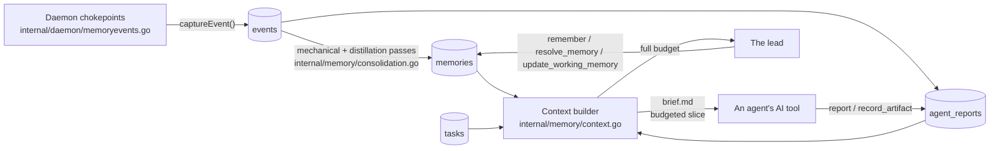
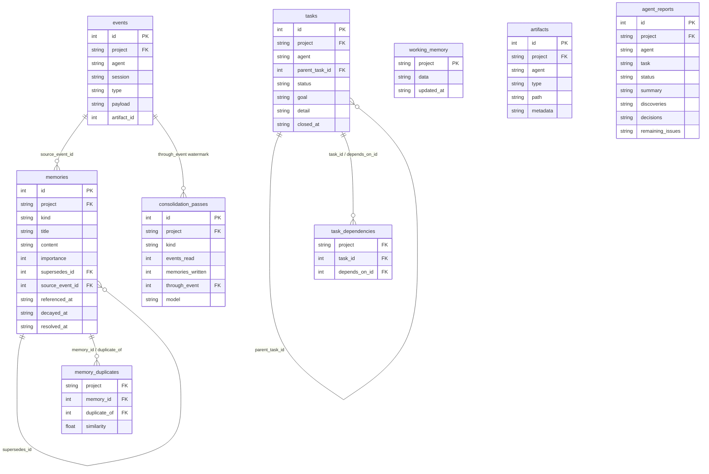

# Project memory

[← back to the index](README.md)

Project memory is what the project knows, kept across agents: events, memories, tasks, artifacts
and reports, all in `state.db` and searched with SQLite's FTS5 — the store itself calls no model
and embeds nothing. It lives in [`internal/memory`](../internal/memory), fed automatically from
the daemon's own chokepoints, thinned by consolidation, and sliced per-agent by a context builder.

## Package layout

- `memory.go` — the core types: `Event`, `Memory`, `Report`, `WorkingMemory`, `Task`, `Artifact`.
- `search.go` — the FTS5 search used by `search_memory`.
- `consolidation.go` — the mechanical pass (duplicates, decay, exact merges) plus the `Pass`/
  `Stats` types logged to `consolidation_passes`.
- `context.go` — the context builder.
- `tasks.go` — the task graph's states and dependency handling.
- `events.go`, `memories.go`, `artifacts.go`, `reports.go`, `working.go` — CRUD/query methods for
  each table.

## Tables

- **events** — append-only raw history (`internal/state/state.go`, migration 23), one row per
  thing that happened. Indexed for FTS5 (`events_fts`, over `type`/`payload`).
- **memories** — the distilled, still-live knowledge (migration 24), FTS5-indexed
  (`memories_fts`, over `title`/`content`). `supersedes_id` links a memory to the one it replaces;
  `resolved_at`/`decayed_at` mark it no longer live without deleting it.
- **working_memory** — one row per project (migration 25): goal, current task, active agents,
  blockers, freeform notes, as JSON in `data`.
- **artifacts** — references to things an agent produced (migration 26): a path plus metadata,
  not the content itself.
- **agent_reports** — an agent's structured finish record (migration 29), FTS5-indexed
  (`reports_fts`): task, status, summary, discoveries, decisions, remaining issues.
- **memory_duplicates** — near-duplicate candidates the mechanical consolidation pass finds
  (migration 30).
- **consolidation_passes** — a log of each consolidation run and what it did (migration 32).
- **tasks** / **task_dependencies** — the project's task graph and its blocking edges
  (migrations 35, 36).

## Search

`search_memory` runs a two-pass FTS5 query (`search.go`): a strict pass (phrases AND-ed together)
first, then a loose pass (OR-ed) to fill in anything the strict pass came up empty on, without
overwriting what it already found. Hits are then reranked — not just left in bm25 order — by a
blend of bm25 score (65%), recency with a 14-day half-life (20%), importance (10%), and kind, with
project-level/decision memories weighted above episodic ones (5%). Superseded or resolved memories
are excluded before the search ever runs. Results come back as three separate ranked lists:
memories, events, reports.

## Automatic capture

The daemon writes events at its own chokepoints, not something an agent has to remember to do —
[`internal/daemon/memoryevents.go`](../internal/daemon/memoryevents.go)'s `captureEvent()` is the
generic entry point, called after things like:

- an agent finishing (`captureAgentFinished()`) — diff stats, PR link, its report's summary;
- a task being created, changing status, or getting blocked (`captureTaskCreated/Status/
  Blocked()`);
- an agent being created against a task (`captureAgentTask()`, which also links or creates the
  task and later closes it via `closeAgentTask()`, mapping a report's status — done/failed/
  partial/blocked — onto the task's).

`captureArtifact()` records a reference whenever something citable is produced.

## Consolidation

Events accumulate; consolidation turns them into fewer, longer-lived memories
(`internal/memory/consolidation.go`):

- **Mechanical pass** — pure SQLite, no model: finds near-duplicate memories (Jaccard similarity
  over normalised title words, same kind), merges exact ones (same title, one contains the
  other verbatim), and decays importance on episodic/issue memories nobody's referenced in 30+
  days.
- **Distillation pass** — runs a model over a window of up to 300 recent events plus the current
  live memories, writing new/superseding memories and a `memory_consolidated` event. It runs on
  the project's own chat's cheap model by default (`consolidation_model = "cheap"`, resolved per
  AI tool), in a session of its own — not the agent's or lead's live conversation — configurable
  per project (`state.go`: `consolidation` sets the event-count trigger, default 200;
  `consolidation_model` picks the model).

Every pass, mechanical or distillation, is logged to `consolidation_passes` with its cost
(events read, memories written/superseded/resolved/decayed, duplicates found, bytes in/out).

## The context builder

`BuildContext()` (`context.go`) assembles what an agent or the lead is actually told, within a
token budget:

1. Load working memory, and a search query — either given, or derived from the project's goal and
   current task.
2. Gather bounded sections: up to 10 open tasks, 8 open issues, 8 high-importance project/decision
   memories, 5 search hits per kind, 5 newest reports, 5 newest artifacts.
3. If the budget's exceeded, drop sections by priority — working memory, tasks, the project's
   story and open issues are never dropped.
4. Mark whatever memories were actually used as referenced, resetting their decay timer.

The lead gets the full budget (`context_budget`, default 4000 tokens); an agent gets a quarter of
it, since its task is narrower. This is the slice that lands in an agent's brief — see
[Project notes and the brief](notes-and-brief.md).

## Tasks

A task's status (`tasks.go`) is one of `open`, `active`, `blocked`, `done` or `abandoned` — the
first three count as open, the last two as closed, and `closed_at` is set the moment a task enters
either. Creating an agent against an open task moves it into `blocked`/`active`/`open` as work
starts; finishing closes it, mapped from the agent's own report status.

## Who can call what

- **Agent-facing** (`agentbox-memory` MCP server, `internal/cli/memory.go`): `search_memory`,
  `my_task`, `update_my_task`, `report`, `record_artifact` — an agent's view is scoped to its own
  task.
- **Lead-facing** (`agentbox` MCP server, `internal/cli/mcp.go`): `search_memory`, `remember`,
  `resolve_memory`, `update_working_memory`, `project_state`, `add_task`, `link_tasks`,
  `set_task_status` — the lead can write memory directly and shape the task graph; see
  [The lead and its MCP tools](lead.md).
