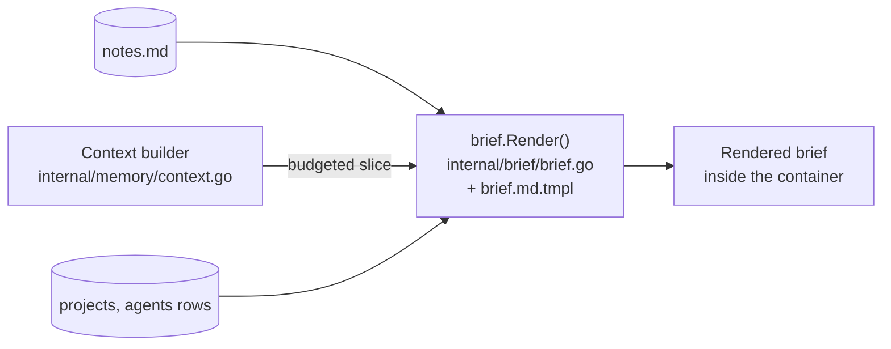

# Project notes and the brief

[← back to the index](README.md)

## Project notes

Each project keeps one markdown file, `notes.md`, under its data directory
(`<data>/projects/<project>/notes.md`, `internal/paths`). It's written by the user directly in
the app, and added to by the lead under its own heading, `## From the lead`
([`internal/notes/notes.go`](../internal/notes/notes.go)).

The lead's three MCP tools (`internal/cli/mcp.go`) all go through `Append()`/`AppendToFile()`:

- `append_note` — writes a new, dated entry under `## From the lead`, creating that section if
  it isn't there yet.
- `edit_note` — changes an existing entry, matched by quoting it.
- `remove_note` — removes an entry, matched the same way.

The user's own notes, anywhere else in the file, are untouched by any of these — the lead only
ever writes inside its own section.

## The brief

The brief is what an AI tool is told about its machine when an agent starts: the project, the
worktree, what the machine can do, and whatever project notes and memory apply. It's rendered by
[`internal/brief`](../internal/brief) from
[`brief.md.tmpl`](../internal/brief/brief.md.tmpl), and dropped into the container as part of
`create_agent` (see [An agent's lifecycle](agent-lifecycle.md)).

Template sections, in order:

1. Header — project, agent, worktree, branch.
2. "This machine is yours" — what the agent is free to do on it.
3. "Project notes" — folded in from `Data.Notes` when non-empty.
4. "What the project knows" — the memory slice from the context builder (`Data.Knowledge`),
   when non-empty.
5. Settings and environment.
6. Cost, token and performance guidance (including `CompactWindowText()`, the compact-window
   size).
7. Git, GitHub, servers, browser and media sections, each conditional on what the agent has
   (`{{if .GitHub}}`, `{{if .Android}}`, and so on).

The brief has golden tests (`internal/brief/brief_test.go`): named cases (`agent`, `android`,
`secrets`, `preview`, `notes`, `knowledge`, ...) each render fixture data through
`brief.Render()` and compare it against a checked-in `.golden` file under `testdata/`. Changing
the template means running `go test ./internal/brief -update` to regenerate those golden files,
and reviewing the diff.
