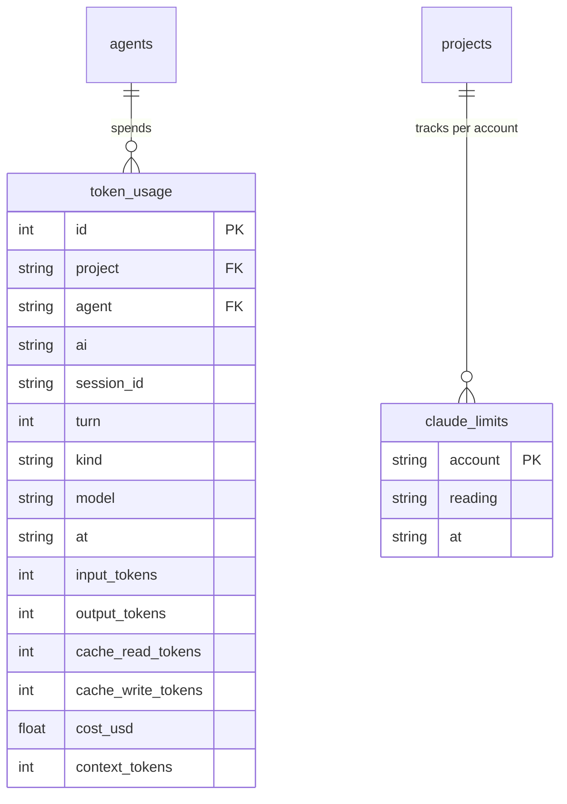

# The token ledger and Claude accounts

[← back to the index](README.md)

What chats spend is kept in a token ledger, one row per model per turn, so it can be read back
per project, per agent, or across a whole account.

## `token_usage`

Written by [`internal/chat/tokens.go`](../internal/chat/tokens.go)'s `book()` as each turn ends.
It reads the turn's per-model token counts from the ACP adapter's `acp.PromptResponse.ByModel`,
and cost from a running total the adapter's `usage_update` notifications add to since the last
booking (reset on `/clear`). `tokenRows()` then writes one row per model used in the turn, sorted
by tokens descending — all of the turn's cost lands on the busiest (first) row, so summing cost
across the rows of one turn doesn't double count it. A turn that reports cost but no tokens (a
failed call, or an autonomous result) still gets one row, under the session's fallback model.
Rows are written off the chat's own lock, in a background goroutine, so booking never blocks the
conversation.

Table (`internal/state/state.go`, migration 39):

`context_tokens` records how full the session's context was at that turn
(`c.session.ContextUsed`) — the CLI shows it as "peak context" per agent, and it's what
`rollover_threshold` (see [Chat over ACP](chat.md)) is measured against to decide when to roll a
session over into a fresh one.

## `agentbox tokens`

[`internal/cli/tokens.go`](../internal/cli/tokens.go) queries the ledger through the daemon
(`internal/daemon/tokens.go`'s `tokenReport()`/`tokenTurns()`). By default it looks back 5 hours
(`tokenWindow`, matching Claude's own usage window), can be filtered to a project/agent, and
`--turns N` switches from aggregated totals to the raw per-turn rows (capped at 1000, default
100). Aggregated output ranks agents by cost, breaking each down by cache read/write and
input/output tokens alongside its peak context.

## Claude accounts and their limits

AgentBox can hold several named Claude Code accounts at once. [`internal/credentials`](../internal/credentials)
stores each as a token file, `<account>.token`, under `~/.local/share/agentbox/claude/`, plus a
`default-account` marker; the default account resolves to whichever is marked, else `"default"`
if that file exists, else the first alphabetically, else none.

- A project's `claude_accounts` column (`projects` table) lists which accounts its agents may
  use — empty means any. `create_agent`'s `claude_account` parameter
  (`internal/cli/mcp.go`) picks one for a given agent, in order: the agent's own, the project's,
  the machine default; an unlisted name is rejected with the valid options.
- Each account's five-hour and weekly usage is kept in `claude_limits`, one row per account,
  populated whenever an agent's chat relays a `usage_update` notification from the adapter
  (`claudeLimited()`, `internal/daemon/limits.go`): the ACP `RateLimit` payload — a status
  (`"allowed"`, `"allowed_warning"`, `"rejected"`), an `isUsingOverage` flag, and
  `UnifiedWindows` (per-window utilization and reset time) — is stored as-is in `reading`, so
  it's read exactly as Claude Code itself reports it, not recomputed by AgentBox. `GET /v1/limits`
  serves it back, filtered to accounts that still exist; `list_accounts` (a lead MCP tool, see
  [The lead and its MCP tools](lead.md)) surfaces the same data.

GitHub accounts are the parallel mechanism for `gh`/PR access — stored the same way
(`<account>.token` plus a `<account>.login` file, under `~/.local/share/agentbox/github/`) and
assignable per project or agent — but they carry no usage limits; `internal/daemon/githubaccount.go`
handles the daemon side of storing and validating them.
